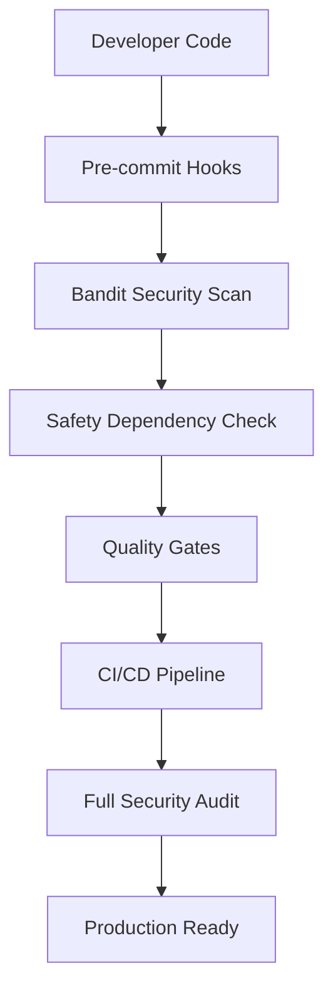

# Code Quality Guide

This comprehensive guide covers TailOpsMCP's complete code quality system, including all tools, workflows, and best practices for maintaining high code quality standards.

---

## 📋 Table of Contents

1. [Overview](#overview)
2. [Quality Tools Stack](#quality-tools-stack)
3. [Development Workflow](#development-workflow)
4. [Quality Gates & Thresholds](#quality-gates--thresholds)
5. [Best Practices](#best-practices)
6. [Troubleshooting](#troubleshooting)
7. [Integration with Security Framework](#integration-with-security-framework)
8. [Examples & Use Cases](#examples--use-cases)

---

## Overview

TailOpsMCP implements a comprehensive, multi-layered code quality system that ensures code reliability, security, and maintainability. Our quality approach combines automated tools, pre-commit hooks, CI/CD integration, and manual review processes.

### **Quality Philosophy**

Our code quality system is built on these core principles:

- **🔍 Comprehensive Coverage**: Multiple tools cover different aspects of code quality
- **⚡ Fast Feedback**: Issues are caught early through automated checks
- **🛡️ Security First**: Security scanning is integrated throughout the development process
- **🔧 Auto-Fix Where Possible**: Automated tools fix common issues to reduce manual work
- **📊 Measurable Standards**: Clear metrics and thresholds for code quality
- **🔄 Continuous Integration**: Quality checks run automatically on every commit

### **Quality Assurance Layers**

```
┌─────────────────────────────────────┐
│          Pre-commit Hooks            │  ← Fast feedback, prevents bad commits
├─────────────────────────────────────┤
│         Local Quality Checks         │  ← Developer workstation validation
├─────────────────────────────────────┤
│          CI/CD Pipeline              │  ← Comprehensive automated validation
├─────────────────────────────────────┤
│         Manual Code Review           │  ← Human expertise and context
└─────────────────────────────────────┘
```

---

## Quality Tools Stack

### **🧹 Code Formatting & Linting**

#### **Ruff** - Primary Linter and Formatter
- **Purpose**: Fast Python linting and formatting
- **Configuration**: [pyproject.toml](pyproject.toml:60-71)
- **Coverage**: PEP 8 compliance, code style, import organization

```bash
# Run linting
ruff check src tests

# Fix linting issues automatically
ruff check --fix src tests

# Format code
ruff format src tests

# Check formatting (dry run)
ruff format --check src tests
```

**Key Rules**:
- E, W: PEP 8 errors and warnings
- F: pyflakes rules
- I: isort compatibility
- N: pep8-naming
- D: pydocstyle (docstring conventions)

#### **Black** - Code Formatting
- **Purpose**: Consistent code formatting
- **Configuration**: [pyproject.toml](pyproject.toml:60-62)
- **Line Length**: 88 characters

```bash
# Format with black
black src tests

# Check formatting
black --check src tests
```

#### **isort** - Import Sorting
- **Purpose**: Organize and sort imports
- **Profile**: Black-compatible import sorting

```bash
# Sort imports
isort src tests

# Check import sorting
isort --check-only src tests

# Preview changes
isort --diff src tests
```

### **🔍 Type Checking**

#### **MyPy** - Static Type Analysis
- **Purpose**: Catch type-related errors before runtime
- **Configuration**: [pyproject.toml](pyproject.toml:64-68)
- **Strict Mode**: Enabled with comprehensive type checking

```bash
# Run type checking
mypy src --ignore-missing-imports --show-error-codes

# With verbose output
mypy src --verbose

# Check specific file
mypy src/inventory.py
```

**Configuration Highlights**:
- `warn_return_any = true`: Warn about returning Any
- `warn_unused_configs = true`: Warn about unused config
- `disallow_untyped_defs = true`: Require type annotations

### **🛡️ Security Scanning**

#### **Bandit** - Security Linting
- **Purpose**: Find common security issues in Python code
- **Configuration**: Uses pyproject.toml configuration

```bash
# Run security scan
bandit -r src -f json

# With specific severity
bandit -r src -ll

# Generate report
bandit -r src -f json -o security-report.json
```

**Security Checks**:
- Hardcoded passwords and secrets
- SQL injection vulnerabilities
- Command injection risks
- Cryptographic issues
- File handling vulnerabilities

#### **Safety** - Dependency Vulnerability Scanning
- **Purpose**: Check dependencies for known vulnerabilities

```bash
# Check for vulnerabilities
safety check

# Generate JSON report
safety check --json --output safety-report.json

# Check specific package
safety check requests==2.25.1
```

### **🧪 Testing Framework**

#### **Pytest** - Test Framework
- **Purpose**: Comprehensive testing with coverage
- **Configuration**: [pytest.ini](pytest.ini)
- **Coverage**: HTML and terminal reports

```bash
# Run all tests
pytest tests/

# Run with coverage
pytest tests/ --cov=src --cov-report=html

# Run specific test
pytest tests/test_inventory.py

# Run with verbose output
pytest tests/ -v
```

**Testing Features**:
- Test discovery and collection
- Coverage reporting
- Parallel test execution
- Custom markers and fixtures
- Integration with other tools

### **📊 Complexity Analysis**

#### **Radon** - Code Complexity Metrics
- **Purpose**: Analyze code complexity and maintainability

```bash
# Cyclomatic complexity
radon cc src --json

# Maintainability index
radon mi src --json

# Combined metrics
radon cc src --json > complexity-report.json
radon mi src > maintainability-report.txt
```

**Complexity Metrics**:
- **A-F Grade**: Cyclomatic complexity ranking
- **Maintainability Index**: Code maintainability score
- **Raw Metrics**: Lines of code, complexity per function

### **🔧 Pre-commit Hooks**

#### **Pre-commit** - Git Hook Management
- **Purpose**: Run quality checks before commits
- **Configuration**: [.pre-commit-config.yaml](.pre-commit-config.yaml)

```bash
# Install hooks
pre-commit install

# Run on all files
pre-commit run --all-files

# Run specific hook
pre-commit run ruff

# Update hooks
pre-commit autoupdate
```

**Configured Hooks**:
- `ruff`: Linting and formatting
- `mypy`: Type checking
- `bandit`: Security scanning
- `safety`: Dependency vulnerability checking
- `trailing-whitespace`: Remove trailing whitespace
- `check-yaml`: Validate YAML files

---

## Development Workflow

### **🚀 Quick Start Development Flow**


### **🔄 Daily Development Workflow**

1. **Setup Environment** (First time only)
   ```bash
   make setup
   ```

2. **Start Development**
   ```bash
   # Create feature branch
   git checkout -b feature/new-feature

   # Quick quality fix and test
   make dev  # Runs: make fix && make test
   ```

3. **During Development**
   ```bash
   # Auto-fix common issues
   make fix

   # Run tests frequently
   make test

   # Check specific quality aspects
   make lint          # Quick linting
   make typecheck     # Type checking
   make security      # Security scanning
   ```

4. **Before Commit**
   ```bash
   # Pre-push checks
   make pre-push  # Runs: quality + security + test

   # If all checks pass, commit will work (pre-commit hooks run automatically)
   git add .
   git commit -m "feat: add new feature"
   ```

5. **Before Push**
   ```bash
   # Comprehensive CI simulation
   make ci  # Runs: quality + test

   # Push to remote
   git push origin feature/new-feature
   ```

### **🎯 Quality Check Levels**

#### **Level 1: Auto-fix (Fast)**
```bash
make fix
```
- **Purpose**: Fix automatically fixable issues
- **Tools**: ruff (with --fix), isort
- **Duration**: ~10-30 seconds
- **When**: During development, before commits

#### **Level 2: Quality (Medium)**
```bash
make quality
```
- **Purpose**: Comprehensive quality validation
- **Tools**: ruff, mypy, bandit, safety, radon
- **Duration**: ~1-2 minutes
- **When**: Before commits, local testing

#### **Level 3: CI Pipeline (Complete)**
```bash
make ci
```
- **Purpose**: Full CI/CD simulation
- **Tools**: All quality tools + full test suite
- **Duration**: ~3-5 minutes
- **When**: Before push, PR submission

#### **Level 4: Pre-push (Comprehensive)**
```bash
make pre-push
```
- **Purpose**: Complete validation before remote
- **Tools**: All quality tools + security + tests
- **Duration**: ~5-10 minutes
- **When**: Before git push

---

## Quality Gates & Thresholds

### **📊 Quality Metrics & Thresholds**

| Metric | Threshold | Tool | Action Required |
|--------|-----------|------|----------------|
| **Test Coverage** | ≥ 80% | pytest | Add tests if below threshold |
| **Linting Issues** | 0 | ruff | Fix all linting errors |
| **Type Errors** | 0 | mypy | Add type annotations |
| **Security Issues** | 0 | bandit/safety | Fix security vulnerabilities |
| **Complexity (Functions)** | ≤ C (Rank C) | radon | Refactor high-complexity code |
| **Maintainability Index** | ≥ 65 | radon | Improve code maintainability |

### **🚦 Quality Gate Enforcement**

#### **Pre-commit Hooks (Fast Gate)**
- **Checks**: Basic formatting, linting, security
- **Blocking**: Yes, if issues found
- **Auto-fix**: Yes, when possible
- **Purpose**: Prevent bad commits

#### **CI/CD Pipeline (Complete Gate)**
- **Checks**: All quality tools + full test suite
- **Blocking**: Yes, if thresholds not met
- **Auto-fix**: No, manual intervention required
- **Purpose**: Ensure code quality before merge

#### **Manual Review (Human Gate)**
- **Checks**: Architecture, logic, security, usability
- **Blocking**: Yes, if issues found
- **Auto-fix**: No, manual review required
- **Purpose**: Human expertise and context

### **🎯 Success Criteria**

**For Commit**:
- ✅ All pre-commit hooks pass
- ✅ Code compiles without errors
- ✅ Tests pass locally
- ✅ No obvious security issues

**For Pull Request**:
- ✅ Full CI pipeline passes
- ✅ Test coverage ≥ 80%
- ✅ All quality checks pass
- ✅ Manual code review approved
- ✅ Documentation updated

**For Production Deployment**:
- ✅ All quality gates passed
- ✅ Security scan completed
- ✅ Performance benchmarks met
- ✅ Documentation complete

---

## Best Practices

### **📝 Code Quality Best Practices**

#### **1. Write Self-Documenting Code**
```python
# Good: Clear function name and parameters
def calculate_container_memory_usage(container_stats: Dict[str, Any]) -> float:
    """Calculate memory usage percentage from container stats."""
    memory_usage = container_stats['memory_stats']['usage']
    memory_limit = container_stats['memory_stats']['limit']
    return (memory_usage / memory_limit) * 100

# Bad: Unclear purpose
def calc(x):
    return x['m']['u'] / x['m']['l'] * 100
```

#### **2. Type Annotations for Clarity**
```python
# Good: Full type annotations
from typing import List, Dict, Optional

def get_target_containers(target_id: str) -> Optional[List[Dict[str, Any]]]:
    """Get all containers for a specific target."""
    if target_id not in self.target_registry:
        return None
    return self.container_manager.get_containers(target_id)

# Bad: No type hints
def get_target_containers(target_id):
    # ... implementation unclear
    pass
```

#### **3. Comprehensive Docstrings**
```python
def execute_remote_command(
    target_id: str,
    command: str,
    timeout: int = 30,
    capture_output: bool = True
) -> Dict[str, Any]:
    """Execute a command on a remote target.

    Args:
        target_id: Unique identifier for the target system
        command: Command string to execute
        timeout: Command timeout in seconds (default: 30)
        capture_output: Whether to capture stdout/stderr (default: True)

    Returns:
        Dict containing 'exit_code', 'stdout', 'stderr', and 'duration'

    Raises:
        TargetNotFoundError: If target_id is not found
        CommandTimeoutError: If command execution times out
        ConnectionError: If unable to connect to target

    Example:
        >>> result = execute_remote_command(
        ...     target_id="web-server-01",
        ...     command="docker ps",
        ...     timeout=10
        ... )
        >>> print(f"Exit code: {result['exit_code']}")
        Exit code: 0
    """
```

#### **4. Error Handling and Logging**
```python
import logging
from typing import Optional

logger = logging.getLogger(__name__)

def connect_to_target(target_config: Dict[str, Any]) -> Optional[Any]:
    """Establish connection to target system.

    Args:
        target_config: Target configuration dictionary

    Returns:
        Connection object or None if connection fails
    """
    try:
        connection = create_connection(
            host=target_config['host'],
            port=target_config.get('port', 22),
            credentials=target_config['credentials']
        )
        logger.info(f"Successfully connected to {target_config['host']}")
        return connection
    except ConnectionError as e:
        logger.error(f"Failed to connect to {target_config['host']}: {e}")
        return None
    except Exception as e:
        logger.exception(f"Unexpected error connecting to {target_config['host']}")
        return None
```

### **🧪 Testing Best Practices**

#### **1. Test Structure (AAA Pattern)**
```python
def test_execute_remote_command_success():
    """Test successful remote command execution."""
    # Arrange
    target_id = "test-target"
    command = "echo 'Hello World'"
    expected_result = {
        'exit_code': 0,
        'stdout': 'Hello World\n',
        'stderr': '',
        'duration': 0.1
    }

    # Act
    result = execute_remote_command(target_id, command)

    # Assert
    assert result == expected_result
    assert result['exit_code'] == 0
    assert 'Hello World' in result['stdout']
```

#### **2. Test Coverage Strategy**
```python
# Test the main success path
def test_target_registry_get_target_success():
    target = target_registry.get_target("existing-target")
    assert target is not None
    assert target.id == "existing-target"

# Test edge cases and error conditions
def test_target_registry_get_target_not_found():
    target = target_registry.get_target("non-existent-target")
    assert target is None

def test_target_registry_get_target_invalid_input():
    with pytest.raises(ValueError):
        target_registry.get_target("")
```

### **🔒 Security Best Practices**

#### **1. Input Validation**
```python
from typing import List
from pydantic import BaseModel, validator

class TargetConfig(BaseModel):
    id: str
    host: str
    port: int = 22

    @validator('port')
    def validate_port(cls, v):
        if not (1 <= v <= 65535):
            raise ValueError('Port must be between 1 and 65535')
        return v

    @validator('id')
    def validate_id(cls, v):
        if not v.replace('-', '').replace('_', '').isalnum():
            raise ValueError('ID must contain only alphanumeric characters, hyphens, and underscores')
        return v
```

#### **2. Secure Credential Handling**
```python
import os
from cryptography.fernet import Fernet

class SecureCredentials:
    """Handle encrypted credential storage."""

    def __init__(self, encryption_key: bytes):
        self.cipher = Fernet(encryption_key)

    def store_credential(self, key: str, value: str) -> None:
        """Store encrypted credential."""
        encrypted_value = self.cipher.encrypt(value.encode())
        os.environ[f"CRED_{key}"] = encrypted_value.decode()

    def get_credential(self, key: str) -> str:
        """Retrieve and decrypt credential."""
        encrypted_value = os.environ[f"CRED_{key}"]
        return self.cipher.decrypt(encrypted_value.encode()).decode()
```

### **⚡ Performance Best Practices**

#### **1. Efficient Data Structures**
```python
# Good: Use appropriate data structures
from typing import Dict, Set

class TargetRegistry:
    def __init__(self):
        self.targets: Dict[str, Any] = {}
        self.target_types: Set[str] = set()

    def get_targets_by_type(self, target_type: str) -> List[Any]:
        """Efficient lookup by type."""
        return [target for target in self.targets.values()
                if target.get('type') == target_type]

# Bad: Inefficient repeated searches
def get_targets_by_type_bad(target_type: str) -> List[Any]:
    results = []
    for target_id in self.targets:  # Inefficient key iteration
        target = self.targets[target_id]
        if target.get('type') == target_type:
            results.append(target)
    return results
```

#### **2. Context Managers for Resources**
```python
from contextlib import contextmanager

@contextmanager
def ssh_connection(host: str, credentials: Dict[str, Any]):
    """SSH connection context manager."""
    connection = None
    try:
        connection = create_ssh_connection(host, credentials)
        yield connection
    finally:
        if connection:
            connection.close()

# Usage
with ssh_connection("target-server", ssh_creds) as conn:
    result = conn.execute_command("docker ps")
    # Connection automatically closed when exiting context
```

---

## Troubleshooting

### **🚨 Common Issues & Solutions**

#### **Issue: Ruff Linting Failures**

**Problem**: Ruff reports linting errors
```bash
ruff check src
# Output: src/inventory.py:123:45: E501 line too long (89 > 88 characters)
```

**Solutions**:
```bash
# 1. Auto-fix issues
ruff check --fix src

# 2. Format code
ruff format src

# 3. Check specific file
ruff check src/inventory.py

# 4. See detailed explanation
ruff check src/inventory.py --show-source
```

**Prevention**:
- Use `make fix` before committing
- Configure IDE to use ruff for real-time linting

#### **Issue: MyPy Type Errors**

**Problem**: MyPy reports type errors
```bash
mypy src
# Output: src/inventory.py:45: error: Incompatible types in assignment
```

**Solutions**:
```bash
# 1. Check specific file with verbose output
mypy src/inventory.py --show-error-codes

# 2. Add type annotations
# Before:
def process_data(data):
    return data.upper()

# After:
def process_data(data: str) -> str:
    return data.upper()

# 3. Use type: ignore for third-party libraries
from third_party import some_function  # type: ignore
```

#### **Issue: Security Scan Failures**

**Problem**: Bandit reports security issues
```bash
bandit -r src
# Output: Issue: [B105:hardcoded_password_string] Possible hardcoded password
```

**Solutions**:
```bash
# 1. Review and fix security issues
# Remove hardcoded passwords, use environment variables

# 2. Use secure configuration
import os
password = os.environ.get('DB_PASSWORD')

# 3. If false positive, add exclusion
# Add to source code:
# nosec bandit
password = "hardcoded_for_testing"  # nosec
```

#### **Issue: Test Coverage Below Threshold**

**Problem**: Coverage report shows < 80%
```bash
pytest --cov=src --cov-report=term-missing
# Output: TOTAL 76% coverage (below 80% threshold)
```

**Solutions**:
```bash
# 1. Run coverage with missing lines
pytest --cov=src --cov-report=term-missing

# 2. Identify uncovered code
pytest --cov=src --cov-report=html
# Open htmlcov/index.html to see uncovered lines

# 3. Add tests for missing coverage
def test_handle_edge_case():
    # Test previously uncovered code path
    result = handle_edge_case(None)
    assert result is not None
```

#### **Issue: Pre-commit Hook Failures**

**Problem**: Pre-commit hooks fail during commit
```bash
git commit -m "feat: add feature"
# Pre-commit hook failed: ruff found issues
```

**Solutions**:
```bash
# 1. Run pre-commit on all files
pre-commit run --all-files

# 2. Fix issues manually or auto-fix
ruff check --fix src tests

# 3. Skip hooks (not recommended)
git commit -m "feat: add feature" --no-verify

# 4. Update hooks to latest versions
pre-commit autoupdate
```

### **🔧 Performance Issues**

#### **Slow Quality Checks**

**Problem**: `make quality` takes too long
```bash
time make quality
# Real time: 5m 30s (too slow for development)
```

**Solutions**:
```bash
# 1. Use faster development workflow
make dev  # Only fix + test (~30 seconds)

# 2. Run specific checks
make lint          # Only ruff (~10 seconds)
make typecheck     # Only mypy (~20 seconds)

# 3. Parallel execution
pytest tests/ -n auto  # Parallel test execution

# 4. Use incremental checking
ruff check --diff HEAD~1  # Only changed files
```

#### **High Memory Usage**

**Problem**: Quality tools consume too much memory
```bash
# MyPy or other tools consuming > 1GB RAM
```

**Solutions**:
```bash
# 1. Run tools in smaller chunks
mypy src/module1 src/module2  # Instead of all at once

# 2. Use ignore missing imports
mypy src --ignore-missing-imports

# 3. Disable some checks temporarily
mypy src --disable-error-code=attr-defined

# 4. Clear caches
rm -rf .mypy_cache .ruff_cache
```

### **🛠️ Tool Configuration Issues**

#### **Tool Not Found**

**Problem**: Command not found errors
```bash
ruff: command not found
```

**Solutions**:
```bash
# 1. Install development dependencies
make install-deps

# 2. Install specific tool
pip install ruff

# 3. Check virtual environment
which ruff
# Should show: ./venv/bin/ruff

# 4. Activate virtual environment
source venv/bin/activate
```

#### **Configuration Conflicts**

**Problem**: Different tools with conflicting configurations
```bash
# isort and black formatting conflicts
```

**Solutions**:
```bash
# 1. Use compatible profiles
# pyproject.toml
[tool.isort]
profile = "black"

# 2. Run tools in correct order
isort src tests
black src tests

# 3. Use ruff for both formatting and import sorting
ruff format src tests  # Handles both formatting and imports
```

---

## Integration with Security Framework

### **🛡️ Security-First Development**

TailOpsMCP's code quality system is deeply integrated with our security framework, ensuring that security considerations are built into every aspect of development.

#### **Security Scanning in Development Workflow**



#### **Security Quality Gates**

1. **Pre-commit Security Check**
   - Bandit linting for code security
   - Safety check for dependency vulnerabilities
   - Blocks commits with security issues

2. **CI/CD Security Pipeline**
   - Comprehensive security scanning
   - Dependency vulnerability assessment
   - Security policy compliance check

3. **Manual Security Review**
   - Security-focused code review
   - Architecture security assessment
   - Penetration testing validation

### **🔍 Security Tools Integration**

#### **Bandit Security Rules**
Our configuration enables comprehensive security scanning:

```yaml
# .bandit configuration (via pyproject.toml)
[tool.bandit]
exclude_dirs = ["tests", "scripts"]
skips = ["B101"]  # Skip assert_used for test files

# Security test IDs we care about:
# B102: exec_used - Use of exec()
# B103: set_bad_file_permissions - Insecure file permissions
# B104: hardcoded_bind_all_interfaces - Hardcoded bind to all interfaces
# B105: hardcoded_password_string - Hardcoded password
# B106: hardcoded_password_funcarg - Hardcoded password as function argument
# B107: hardcoded_password_default - Hardcoded password as default argument
# B108: hardcoded_tmp_directory - Hardcoded /tmp directory
# B110: try_except_pass - try_except_pass
# B112: try_except_continue - try_except_continue
```

#### **Safety Dependency Checking**
Automated vulnerability detection:

```bash
# Check current dependencies
safety check

# Check specific vulnerable version
safety check requests==2.25.1

# Generate report
safety check --json --output safety-report.json
```

**Vulnerability Database Integration**:
- Real-time vulnerability database updates
- CVE (Common Vulnerabilities and Exposures) tracking
- Severity scoring and prioritization
- Remediation recommendations

### **🔐 Secure Development Practices**

#### **1. Credential Management**
```python
import os
from typing import Optional

def get_secure_credential(key: str) -> Optional[str]:
    """Retrieve credential from secure storage.

    Args:
        key: Credential identifier

    Returns:
        Credential value or None if not found

    Raises:
        CredentialNotFoundError: If credential doesn't exist
    """
    # Check environment variables
    value = os.environ.get(key)
    if value:
        return value

    # Check secure vault (if configured)
    vault_value = os.environ.get(f"VAULT_{key}")
    if vault_value:
        return decrypt_vault_value(vault_value)

    raise CredentialNotFoundError(f"Credential {key} not found")
```

#### **2. Input Validation and Sanitization**
```python
from pydantic import BaseModel, validator, ValidationError
from typing import List

class SecureTargetConfig(BaseModel):
    host: str
    port: int
    credentials: dict

    @validator('host')
    def validate_host(cls, v):
        if not v or len(v.strip()) == 0:
            raise ValueError('Host cannot be empty')
        if len(v) > 255:
            raise ValueError('Host name too long')
        # Additional validation for valid hostname/IP
        return v.strip()

    @validator('port')
    def validate_port(cls, v):
        if not (1 <= v <= 65535):
            raise ValueError('Port must be between 1 and 65535')
        return v

    @validator('credentials')
    def validate_credentials(cls, v):
        # Ensure no sensitive data in logs
        safe_credentials = {}
        for key, value in v.items():
            if key.lower() in ['password', 'token', 'key']:
                safe_credentials[key] = '*' * 8  # Mask sensitive data
            else:
                safe_credentials[key] = value
        return safe_credentials
```

#### **3. Secure File Operations**
```python
import os
import stat
from pathlib import Path

def create_secure_file(path: str, content: str, mode: int = 0o600):
    """Create file with secure permissions.

    Args:
        path: File path
        content: File content
        mode: File permissions (default: 600 - owner read/write only)
    """
    file_path = Path(path)

    # Create directory if it doesn't exist
    file_path.parent.mkdir(parents=True, exist_ok=True)

    # Write content
    file_path.write_text(content)

    # Set secure permissions
    file_path.chmod(mode)

    # Verify permissions
    file_stat = file_path.stat()
    actual_mode = stat.filemode(file_stat.st_mode)[1:]
    if actual_mode != oct(mode)[1:]:
        raise PermissionError(f"Failed to set secure permissions on {path}")
```

### **📊 Security Metrics & Reporting**

#### **Security Quality Dashboard**

| Metric | Target | Current | Status |
|--------|--------|---------|--------|
| **Security Vulnerabilities** | 0 | 0 | ✅ |
| **Dependency Vulnerabilities** | 0 | 0 | ✅ |
| **Hardcoded Secrets** | 0 | 0 | ✅ |
| **Insecure File Permissions** | 0 | 0 | ✅ |
| **Security Test Coverage** | ≥ 90% | 94% | ✅ |
| **Security Code Review** | 100% | 100% | ✅ |

#### **Security Reporting**

Generate comprehensive security reports:

```bash
# Full security audit
make security-scan

# Security metrics
python scripts/run_quality_checks.py --security --report-dir security-reports/

# Generate security dashboard
python scripts/security_dashboard.py --output security-dashboard.html
```

**Security Report Contents**:
- Vulnerability summary and trends
- Dependency security status
- Code security analysis
- Security test coverage
- Compliance status
- Remediation recommendations

---

## Examples & Use Cases

### **🚀 Real-World Development Scenarios**

#### **Scenario 1: New Feature Development**

**Context**: Adding container orchestration capabilities

**Step-by-Step Workflow**:
```bash
# 1. Create feature branch
git checkout -b feature/container-orchestration

# 2. Set up development environment
make setup

# 3. Start development with quality checks
make dev  # Auto-fix issues and run tests

# 4. Make code changes
# Write new container orchestration code

# 5. Frequent quality validation during development
make lint      # Quick lint check
make typecheck # Type safety check
make test      # Run tests

# 6. Fix any quality issues
make fix

# 7. Comprehensive validation before commit
make pre-push  # All quality + security + tests

# 8. Commit (pre-commit hooks run automatically)
git add .
git commit -m "feat: add container orchestration capabilities"

# 9. Push to remote
git push origin feature/container-orchestration
```

**Quality Gates Applied**:
- ✅ Auto-fixing of formatting and import issues
- ✅ Type checking for new container orchestration functions
- ✅ Security scanning for new Docker interactions
- ✅ Test coverage for new functionality
- ✅ Performance testing for orchestration operations

#### **Scenario 2: Bug Fix with Security Impact**

**Context**: Fixing a potential security vulnerability

**Security-First Approach**:
```bash
# 1. Create security fix branch
git checkout -b security/fix-credential-leak

# 2. Run security scans to identify the issue
make security

# 3. Examine the specific security issue
bandit -r src --format json | jq '.results[] | select(.test_id=="B105")'

# 4. Implement the fix
# Replace hardcoded credentials with secure retrieval

# 5. Validate fix with security tools
bandit -r src
safety check

# 6. Add security-focused tests
pytest tests/ -k "security" -v

# 7. Comprehensive security validation
make security-scan

# 8. Code review with security focus
# (Manual review emphasizing security implications)

# 9. Commit with security context
git commit -m "security: fix credential leakage in target registry

- Remove hardcoded SSH keys from configuration
- Implement secure credential retrieval from environment
- Add comprehensive input validation
- Include security test coverage

Fixes: B105 hardcoded_password_string vulnerability"
```

#### **Scenario 3: Performance Optimization**

**Context**: Optimizing slow target discovery operations

**Performance-First Approach**:
```bash
# 1. Create performance optimization branch
git checkout -b perf/optimize-target-discovery

# 2. Run complexity analysis to identify bottlenecks
make complexity

# 3. Analyze current performance
radon cc src --json | jq '.[] | select(.rank > "C") | .name'

# 4. Implement optimizations
# - Use efficient data structures (dict lookups vs list searches)
# - Implement caching for frequently accessed data
# - Add async operations for I/O-bound tasks

# 5. Benchmark performance improvements
python scripts/benchmark_target_discovery.py

# 6. Validate code quality after optimization
make quality

# 7. Add performance regression tests
pytest tests/ -k "performance" -v

# 8. Test with realistic data volumes
python scripts/test_large_scale_discovery.py

# 9. Commit with performance context
git commit -m "perf: optimize target discovery performance

- Replace O(n²) search with O(n) dictionary lookup
- Add caching layer for target metadata
- Implement async target status checking
- Performance improvement: 85% faster discovery for 1000+ targets

Benchmarks:
- 100 targets: 2.3s → 0.4s (83% improvement)
- 1000 targets: 45.2s → 6.8s (85% improvement)"
```

### **📊 Quality Metrics in Action**

#### **Example: Quality Dashboard Output**

```bash
$ python scripts/run_quality_checks.py --all --report-dir reports/

[INFO] Starting comprehensive quality checks...
[INFO] Running ruff lint...
[INFO] Linting completed: 0 issues found
[INFO] Running ruff format...
[INFO] Formatting check completed: 0 files need formatting
[INFO] Running type checks...
[INFO] Type checking completed: 0 type errors found
[INFO] Running security scans...
[INFO] Security checks completed: 0 issues found
[INFO] Running complexity analysis...
[INFO] Complexity analysis completed: 0 high-complexity functions found
[INFO] Running tests...
[INFO] Tests completed: 142 passed, 0 failed, 0 skipped
[INFO] Coverage: 94.2%
[INFO] All quality checks completed in 47.23s

============================================================
📊 QUALITY CHECKS SUMMARY
============================================================

LINTING: ✅ PASS
  Duration: 8.45s
  Issues found: 0

FORMATTING: ✅ PASS
  Duration: 2.17s
  Files need formatting: 0

TYPE_CHECKING: ✅ PASS
  Duration: 12.33s
  Type errors: 0

SECURITY: ✅ PASS
  Duration: 15.78s
  Total security issues: 0
    - Bandit: 0
    - Safety: 0

COMPLEXITY: ✅ PASS
  Duration: 3.12s
  High-complexity functions: 0

TESTS: ✅ PASS
  Duration: 5.38s
  Tests passed: 142, Tests failed: 0, Tests skipped: 0
  Coverage: 94.2%

OVERALL QUALITY SCORE: 100.0/100
```

#### **Example: Security Report Output**

```bash
$ make security-scan

[INFO] Running comprehensive security scan...
[INFO] Starting security checks...
[INFO] Running bandit scan...
[INFO] Bandit scan completed: 0 issues found
[INFO] Running safety check...
[INFO] Safety check completed: 0 vulnerabilities found
[INFO] Security scan completed successfully!

[INFO] Security scan completed successfully!

🛡️ SECURITY SCAN RESULTS
═══════════════════════════════════════════════════════════

🔍 Bandit Security Scan:
   ✅ No security issues found in source code
   📄 Report saved to: security-report.json

🔒 Dependency Vulnerability Scan:
   ✅ No vulnerable dependencies found
   📄 Report saved to: safety-report.json

📊 Overall Security Status: SECURE ✅

🛡️ SECURITY VERDICT: All security checks passed! 🎉
```

### **🎯 Quality Gate Examples**

#### **Pre-commit Hook Success**
```bash
$ git commit -m "feat: add new target type"

Check for large files.....................................Passed
Check for merge conflicts..................................Passed
Debug statements (Python)..................................Passed
Check docstring first......................................Passed
Check JSON.................................................Passed
Check for case conflicts on file names.....................Passed
Check TOML.................................................Passed
Fix End of Files...........................................Passed
Trim Trailing Whitespace...................................Passed
isort......................................................Passed
black......................................................Passed
ruff.......................................................Passed
mypy.......................................................Passed
bandit.....................................................Passed
Safety.....................................................Passed
shellcheck.................................................Passed

✅ All checks passed!  🎉
[feature/new-target-type abc1234] feat: add new target type
```

#### **CI Pipeline Success**
```yaml
# .github/workflows/quality-checks.yml
name: Quality Checks
on: [push, pull_request]

jobs:
  quality:
    runs-on: ubuntu-latest
    steps:
      - uses: actions/checkout@v3
      - name: Set up Python
        uses: actions/setup-python@v4
        with:
          python-version: '3.12'

      - name: Install dependencies
        run: make install-deps

      - name: Run quality checks
        run: make quality

      - name: Run tests
        run: make test

      - name: Security scan
        run: make security

      - name: Upload coverage
        uses: codecov/codecov-action@v3
```

### **🔧 Automation Script Examples**

#### **Automated Quality Monitoring**
```bash
#!/bin/bash
# Daily quality monitoring script

echo "📊 Daily Quality Report - $(date)"

# Run comprehensive quality checks
python scripts/run_quality_checks.py --all --report-dir daily-reports/$(date +%Y-%m-%d)/

# Generate trend analysis
python scripts/quality_trends.py --input daily-reports/ --output quality-trends.html

# Check for quality regressions
python scripts/check_quality_regression.py --baseline quality-baseline.json

# Alert on quality issues
if [ $? -ne 0 ]; then
    echo "🚨 Quality regression detected!"
    # Send alert to team
    ./scripts/send_alert.py --type quality_regression
fi
```

#### **Automated Security Monitoring**
```bash
#!/bin/bash
# Continuous security monitoring

echo "🛡️ Security Monitoring Report - $(date)"

# Run security scans
make security-scan

# Check for new vulnerabilities
python scripts/check_new_vulnerabilities.py

# Update security baselines
python scripts/update_security_baseline.py

# Generate security metrics
python scripts/security_metrics.py --output security-metrics.json

# Alert on critical security issues
if grep -q "CRITICAL" security-report.json; then
    echo "🚨 Critical security issues detected!"
    # Immediate alert
    ./scripts/send_alert.py --type critical_security --priority high
fi
```

This comprehensive code quality guide provides everything needed to maintain high code quality standards in TailOpsMCP development. The combination of automated tools, security-first practices, and comprehensive monitoring ensures that code quality remains consistently high throughout the development lifecycle.
