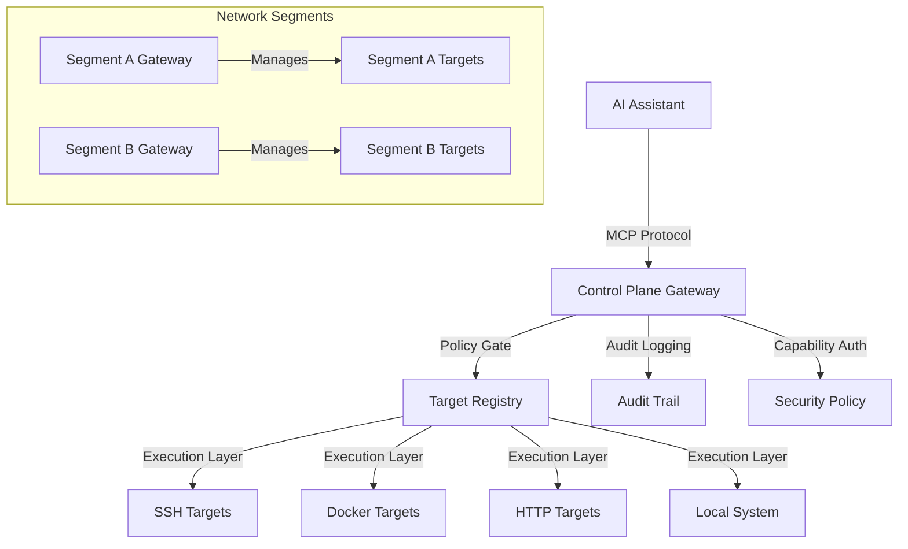

# SystemManager Control Plane Gateway

🛰️ **SystemManager — A secure control plane gateway for managing distributed infrastructure**

> **Centralized management of multiple targets through a single control plane gateway — powered by MCP**
> Model Context Protocol (MCP) server that operates as a control plane gateway, managing SSH, Docker, and HTTP targets through capability-based authorization and policy enforcement.

[](https://opensource.org/licenses/MIT)
[](https://www.python.org/downloads/)
[](https://www.docker.com/)
[](https://www.proxmox.com/)
[](https://tailscale.com/)

---

## 🎯 What is SystemManager?

SystemManager is a control plane gateway that centralizes management of distributed infrastructure through AI assistants like Claude, ChatGPT, or any MCP-compatible client. Instead of deploying agents on every node, you deploy a single gateway that manages multiple targets through SSH, Docker, and HTTP connections.

**Key Operational Model:**
- **Control Plane Gateway**: Single trusted node manages multiple targets
- **Target Registry**: Central configuration of managed systems
- **Policy Gate**: Capability-based authorization prevents "LLM imagination" risk
- **Execution Layer**: Orchestrates commands across different target types

Instead of remembering complex commands, just ask:

- *"Deploy my monitoring stack to all web servers"*
- *"Analyze security logs across the production cluster"*
- *"What's using all the CPU across all database nodes?"*
- *"Update packages on all staging servers"*

Perfect for **infrastructure teams**, **SREs**, and **DevOps engineers** managing distributed systems across multiple environments.

---

## ✨ Key Features

### 🚀 **Current Capabilities**

#### **Control Plane Architecture**
- ✅ **Target Registry** - Central configuration of SSH, Docker, and HTTP targets
- ✅ **Policy Gate** - Capability-based authorization with parameter validation
- ✅ **Execution Layer** - Orchestrates commands across multiple target types
- ✅ **Multi-Target Operations** - Execute commands across groups of targets

#### **Target Management**
- ✅ **SSH Target Support** - Manage remote systems via SSH connections
- ✅ **Docker Socket Access** - Control Docker hosts through socket connections
- ✅ **HTTP API Integration** - Interact with web services and APIs
- ✅ **Local System Management** - Manage the gateway host itself

#### **Security & Operations**
- ✅ **Capability-Based Authorization** - Prevent "LLM imagination" risk through explicit allowlisting
- ✅ **Parameter Validation** - Enforce constraints on operation parameters
- ✅ **Audit Logging** - Comprehensive tracking of all gateway operations
- ✅ **Multi-Gateway Support** - Redundant gateways for high availability

### 🔒 **Security First**

⚠️ **[Read the Security Advisory](./docs/SECURITY_ADVISORY.md)** before production deployment

- ✅ **Tailscale Required** - Encrypted transport mandatory (no built-in TLS)
- ✅ **OAuth 2.1 with TSIDP** - Tailscale Identity Provider authentication
- ✅ **Non-Root Service** - Runs as dedicated `systemmanager` user
- ✅ **Systemd Hardening** - Full sandboxing with ProtectSystem, ProtectHome
- ✅ **Audit Logging** - Complete tracking of all operations
- ✅ **Scope-Based Access** - Fine-grained permission control
- ⚠️ **Approval Gates** - Requires external webhook (not built-in)

### 🔮 **Roadmap** (See [HOMELAB_FEATURES.md](./HOMELAB_FEATURES.md))

- 🔄 **LXC Network Auditing** - Review and audit container network configs
- 🔄 **Backup & Snapshots** - Automated backups with verification
- 🔄 **Certificate Management** - Let's Encrypt automation
- 🔄 **Reverse Proxy Management** - Traefik/Nginx/Caddy configuration
- 🔄 **Proxmox API Integration** - Full VM/container management
- 🔄 **Security Scanning** - Container vulnerability detection

---

## 🏗️ Control Plane Gateway Architecture



### **Architecture Overview**

**Control Plane Gateway Model:**
- **Single Gateway**: One trusted node manages multiple targets
- **Target Registry**: Central configuration of managed systems
- **Policy Enforcement**: Capability-based authorization prevents unauthorized operations
- **Execution Orchestration**: Commands routed to appropriate targets

**Security Benefits:**
- **Reduced Blast Radius**: Compromise affects only gateway, not all targets
- **Capability Allowlisting**: Explicit authorization prevents "LLM imagination" risk
- **Segment Isolation**: Gateways can be deployed per network segment
- **Audit Trail**: Comprehensive logging of all gateway operations

**Operational Model:**
- **Gateway Deployment**: Typically runs in Proxmox LXC containers for isolation
- **Target Connectivity**: SSH keys, Docker sockets, HTTP APIs for target access
- **Redundancy**: Multiple gateways can manage overlapping target sets
- **Maintenance**: Single point of control for updates and configuration

---

## 🚀 Quick Start

### **Control Plane Gateway Deployment**

#### **Step 1: Deploy Gateway Container**

Deploy the control plane gateway in a Proxmox LXC container for isolation:

```bash
# Automated Proxmox installer (recommended)
bash -c "$(wget -qLO - https://raw.githubusercontent.com/mdlmarkham/SystemManager/master/ct/build.func)"
```

This creates an isolated gateway container with:
- Debian 12 LXC (2GB RAM, 2 CPU cores, 4GB disk)
- Python 3.12 and all dependencies
- Tailscale OAuth authentication
- Systemd service configuration

#### **Step 2: Configure Target Registry**

Create your [`targets.yaml`](targets.yaml:1) configuration file:

```yaml
version: "1.0"
targets:
  # Local gateway management
  local:
    id: "local"
    type: "local"
    executor: "local"
    capabilities:
      - "system:read"
      - "container:read"
      - "network:read"

  # SSH target example
  web-server-01:
    id: "web-server-01"
    type: "remote"
    executor: "ssh"
    connection:
      host: "192.168.1.100"
      username: "admin"
      key_path: "${SSH_KEY_WEB_SERVER_01}"
    capabilities:
      - "system:read"
      - "container:read"
```

#### **Step 3: Connect AI Assistant**

Configure your MCP-compatible AI assistant to connect to the gateway:

```json
{
  "mcpServers": {
    "systemmanager": {
      "command": "python",
      "args": ["-m", "src.mcp_server"],
      "env": {
        "SYSTEMMANAGER_TARGETS_CONFIG": "/path/to/targets.yaml"
      }
    }
  }
}
```

### **Multi-Gateway Deployment**

For redundancy and segment isolation, deploy multiple gateways:

```bash
# Deploy to multiple containers for redundancy
./install-proxmox-multi.sh --containers 101,102,103 --auth token
```

**Benefits:**
- ✅ **Redundancy**: Multiple gateways can manage overlapping target sets
- ✅ **Segment Isolation**: Deploy gateways per network segment
- ✅ **Load Distribution**: Spread management across multiple gateways
- ✅ **Maintenance**: Update gateways without affecting all targets

**See [PROXMOX_MULTI_CONTAINER_INSTALL.md](./docs/PROXMOX_MULTI_CONTAINER_INSTALL.md) for complete multi-container deployment documentation.**

### **Gateway Configuration & Target Setup**

#### **Target Registry Configuration**

After deploying the gateway, configure your [`targets.yaml`](targets.yaml:1) file to define managed targets:

```yaml
version: "1.0"
targets:
  # Local gateway management
  local:
    id: "local"
    type: "local"
    executor: "local"
    capabilities:
      - "system:read"
      - "container:read"
      - "network:read"

  # SSH target for remote server
  web-server-01:
    id: "web-server-01"
    type: "remote"
    executor: "ssh"
    connection:
      host: "192.168.1.100"
      username: "admin"
      key_path: "${SSH_KEY_WEB_SERVER_01}"
    capabilities:
      - "system:read"
      - "container:read"

  # Docker socket target
  docker-host-01:
    id: "docker-host-01"
    type: "remote"
    executor: "docker"
    connection:
      socket_path: "/var/run/docker.sock"
    capabilities:
      - "container:read"
      - "container:control"
```

#### **Secrets Management**

Store sensitive credentials securely:

```bash
# Create environment file for secrets
cp deploy/.env.template .env
nano .env

# Add SSH keys and credentials
SSH_KEY_WEB_SERVER_01="/path/to/private/key"
DOCKER_HOST_TOKEN="your-docker-api-token"

# Secure the file
chmod 600 .env
```

#### **Connectivity Requirements**

Ensure gateway can reach targets:
- **SSH Targets**: Network connectivity and SSH key authentication
- **Docker Targets**: Docker socket access or API endpoint
- **HTTP Targets**: Network connectivity and API credentials
- **Tailscale**: Subnet routes for cross-network access

### **Manual Installation (Alternative)**

For non-Proxmox environments:

```bash
# Download and run the installer
curl -fsSL https://raw.githubusercontent.com/mdlmarkham/SystemManager/master/install.sh | sudo bash

# Or clone and run manually
git clone https://github.com/mdlmarkham/SystemManager.git
cd SystemManager
sudo bash install.sh
```

The installer will:
1. ✅ Check system requirements
2. ✅ Install Python dependencies
3. ✅ Set up systemd service
4. ✅ Configure authentication
5. ✅ Create secure environment file
6. ✅ Start the gateway service

### **Post-Installation Verification**

```bash
# Check gateway service status
sudo systemctl status systemmanager-mcp

# View gateway logs
sudo journalctl -u systemmanager-mcp -f

# Test gateway connectivity
curl http://localhost:8080/.well-known/oauth-protected-resource/mcp

# Verify target registry loading
sudo journalctl -u systemmanager-mcp | grep "targets.yaml"
```

---

## 🔐 Security & Connectivity

### **Tailscale Integration for Gateway Security**

SystemManager uses **Tailscale Identity Provider (TSIDP)** for OAuth 2.1 authentication, providing secure gateway access control.

#### **Gateway Network Security**

Configure Tailscale ACLs to control gateway access:

```json
{
  "acls": [
    {
      "action": "accept",
      "src": ["group:systemmanager-admins"],
      "dst": ["tag:systemmanager-gateway:8080"]
    }
  ],
  "tagOwners": {
    "tag:systemmanager-gateway": ["group:systemmanager-admins"]
  }
}
```

#### **Target Network Connectivity**

Ensure gateways can reach targets through Tailscale:

- **Subnet Routes**: Configure Tailscale subnet routes for cross-network access
- **ACL Rules**: Allow gateway-to-target communication
- **Service Tags**: Use tags for gateway service discovery

### **Gateway-to-Target Connectivity**

#### **SSH Target Requirements**
- Network connectivity between gateway and target
- SSH key authentication configured
- Firewall rules allowing SSH access
- Tailscale subnet routes if crossing networks

#### **Docker Target Requirements**
- Docker socket access or API endpoint reachable
- Network connectivity to Docker host
- API token authentication if using remote API

#### **HTTP Target Requirements**
- Network connectivity to API endpoint
- Authentication credentials (API keys, tokens)
- TLS/SSL certificate validation

### **Multi-Gateway Network Design**

For segment isolation and redundancy:

```yaml
# Segment A Gateway
segment-a-gateway:
  network_segment: "production-a"
  targets: ["web-a-01", "db-a-01", "cache-a-01"]
  
# Segment B Gateway
segment-b-gateway:
  network_segment: "production-b"
  targets: ["web-b-01", "db-b-01", "cache-b-01"]
  
# Overlapping targets for redundancy
shared-targets: ["monitoring-01", "logging-01"]
```

---

## 🐳 Gateway Deployment & Management

### **Proxmox LXC Gateway Deployment**

SystemManager gateways are typically deployed in Proxmox LXC containers for isolation and security.

#### **Recommended LXC Configuration**

```bash
# /etc/pve/lxc/103.conf
arch: amd64
cores: 2
memory: 2048
net0: name=eth0,bridge=vmbr0,firewall=1,ip=dhcp
rootfs: local-lvm:vm-103-disk-0,size=8G

# Enable Docker for target management
features: nesting=1,keyctl=1
lxc.apparmor.profile: unconfined
lxc.cgroup2.devices.allow: c 10:200 rwm  # /dev/net/tun for Tailscale
```

#### **Gateway Container Features**

- **Isolation**: LXC containers provide process and network isolation
- **Resource Control**: CPU and memory limits prevent gateway resource exhaustion
- **Security**: AppArmor profiles and cgroup device controls
- **Network Access**: Tailscale integration for secure remote access

### **Multi-Gateway Deployment Strategy**

#### **Segment-Based Deployment**

Deploy gateways per network segment to limit blast radius:

```yaml
# Production Segment A
production-a-gateway:
  segment: "production-a"
  targets: ["web-a-01", "db-a-01", "cache-a-01"]
  
# Production Segment B
production-b-gateway:
  segment: "production-b"
  targets: ["web-b-01", "db-b-01", "cache-b-01"]
  
# Staging Segment
staging-gateway:
  segment: "staging"
  targets: ["staging-web-01", "staging-db-01"]
```

#### **Redundancy Configuration**

Multiple gateways can manage overlapping target sets:

```yaml
# Primary gateway for production
primary-gateway:
  targets: ["web-01", "db-01", "cache-01", "monitoring-01"]
  
# Secondary gateway for redundancy
secondary-gateway:
  targets: ["web-01", "db-01", "cache-01", "logging-01"]
```

### **Gateway Maintenance Procedures**

#### **Updates & Upgrades**

```bash
# Update gateway software
sudo systemctl stop systemmanager-mcp
cd /opt/systemmanager
git pull
pip install -r requirements.txt
sudo systemctl start systemmanager-mcp

# Verify gateway health
sudo systemctl status systemmanager-mcp
sudo journalctl -u systemmanager-mcp --since "5 minutes ago"
```

#### **Target Registry Management**

```bash
# Backup target registry
cp /opt/systemmanager/targets.yaml /opt/systemmanager/targets.yaml.backup

# Validate target configuration
python -c "from src.services.target_registry import TargetRegistry; tr = TargetRegistry(); print('Valid targets:', list(tr._targets.keys()))"

# Reload target registry without restart
sudo systemctl reload systemmanager-mcp
```

---

## 📦 Target Registry & Capability Management

### **Target Registry Configuration**

The Target Registry is the central configuration for all managed targets. It defines what systems the gateway can manage and what operations are allowed.

#### **Target Types & Capabilities**

```yaml
# targets.yaml - Complete example
version: "1.0"
targets:
  # Local gateway management
  local:
    id: "local"
    type: "local"
    executor: "local"
    capabilities:
      - "system:read"
      - "container:read"
      - "network:read"
      - "file:read"
    constraints:
      timeout: 30
      concurrency: 5

  # SSH target for remote server
  web-server-01:
    id: "web-server-01"
    type: "remote"
    executor: "ssh"
    connection:
      host: "192.168.1.100"
      port: 22
      username: "admin"
      key_path: "${SSH_KEY_WEB_SERVER_01}"
    capabilities:
      - "system:read"
      - "container:read"
      - "network:read"
    constraints:
      timeout: 60
      sudo_policy: "limited"

  # Docker socket target
  docker-host-01:
    id: "docker-host-01"
    type: "remote"
    executor: "docker"
    connection:
      socket_path: "/var/run/docker.sock"
    capabilities:
      - "container:read"
      - "container:control"
      - "stack:deploy"
```

#### **Capability-Based Authorization**

Each target defines explicit capabilities to prevent "LLM imagination" risk:

- **system:read**: Read system information (CPU, memory, disk)
- **container:read**: Inspect containers and services
- **container:control**: Start/stop/restart containers
- **network:read**: View network status and connectivity
- **file:read**: Read and search files
- **stack:deploy**: Deploy Docker compose stacks

### **Policy Gate Security**

The Policy Gate enforces security policies across all operations:

```python
# Example policy enforcement
await policy_gate.authorize(
    operation="restart_container",
    target="docker-host-01",
    tier="control",
    parameters={"container": "nginx"}
)
```

**Security Benefits:**
- ✅ **Explicit Authorization**: Only explicitly allowed operations are permitted
- ✅ **Parameter Validation**: Operation parameters are validated against constraints
- ✅ **Audit Trail**: All policy decisions are logged for compliance
- ✅ **Dry Run Mode**: Test operations without execution

### **Multi-Target Operations**

Execute commands across multiple targets:

```python
# Health check across all web servers
health_check(targets=["web-server-01", "web-server-02", "web-server-03"])

# Package update across staging environment
update_packages(targets=["staging-web-01", "staging-db-01", "staging-cache-01"])

# Security audit across production segment
audit_security(targets=["prod-web-01", "prod-db-01", "prod-cache-01"])
```

---

## 🐋 Docker Integration

### Docker Compose Stack Management

Deploy and manage stacks like Portainer/Komodo:

```python
# Deploy stack from GitHub
deploy_stack(
    stack_name="monitoring",
    repo_url="https://github.com/user/prometheus-stack",
    branch="main",
    env_vars={"DOMAIN": "metrics.home.lab"}
)

# Update stack (git pull + docker compose up)
update_stack("monitoring")

# List all stacks
list_stacks()
```

### Container Management

```python
# AI-powered log analysis
analyze_container_logs(
    name_or_id="nginx",
    context="Why is it restarting?"
)

# Start/stop/restart
manage_container(action="restart", name_or_id="nginx")

# Get container list with status
get_container_list()
```

---

## 📊 Usage Examples

### With Claude Desktop

Add to your `claude_desktop_config.json`:
```json
{
  "mcpServers": {
    "tailopsmcp": {
      "type": "http",
      "url": "http://your-server.tail12345.ts.net:8080/mcp"
    }
  }
}
```

Then ask Claude:
- *"Show me system status"*
- *"What are the top processes by CPU usage?"*
- *"Analyze the syslog for security issues"*
- *"Check if my web server container is running"*
- *"Test connectivity to database.home.lab:5432"*
- *"Pull the latest nginx image"*

### With GitHub Copilot Chat (VS Code)

The MCP protocol is supported natively - just install and reload VS Code.

Example prompts:
- *"@tailopsmcp what containers are running?"*
- *"@tailopsmcp analyze Docker logs for my app container"*
- *"@tailopsmcp check system resource usage"*

### Programmatic Access (Python)

```python
import requests

# Token-based auth
headers = {"Authorization": f"Bearer {token}"}

# OAuth-based auth
# (OAuth flow handled by MCP client)

response = requests.post(
    "http://your-server:8080/mcp",
    json={
        "method": "tools/call",
        "params": {
            "name": "get_system_status",
            "arguments": {"format": "json"}
        }
    },
    headers=headers
)

print(response.json())
```

---

## 🔧 Configuration

### Environment Variables

SystemManager is configured via `/opt/systemmanager/.env`:

```bash
# Authentication Mode (oidc or token)
SYSTEMMANAGER_AUTH_MODE=oidc
SYSTEMMANAGER_REQUIRE_AUTH=true

# Tailscale OAuth (TSIDP)
TSIDP_URL=https://tsidp.tail12345.ts.net
TSIDP_CLIENT_ID=your_client_id
TSIDP_CLIENT_SECRET=your_client_secret
SYSTEMMANAGER_BASE_URL=http://server.tail12345.ts.net:8080

# Or Token-based
# SYSTEMMANAGER_SHARED_SECRET=your_secret_here

# Logging
LOG_LEVEL=INFO  # DEBUG, INFO, WARNING, ERROR
```

### Service Management

```bash
# Check status
sudo systemctl status systemmanager-mcp

# View logs
sudo journalctl -u systemmanager-mcp -f

# Restart
sudo systemctl restart systemmanager-mcp

# Enable/disable auto-start
sudo systemctl enable systemmanager-mcp
sudo systemctl disable systemmanager-mcp
```

### Update to Latest Version

```bash
# Run the update script (Proxmox LXC only)
pct exec 103 -- bash -c "$(wget -qLO - https://raw.githubusercontent.com/mdlmarkham/SystemManager/master/ct/build.func)" -s --update

# Or manually
cd /opt/systemmanager
sudo systemctl stop systemmanager-mcp
git pull
source venv/bin/activate
pip install --upgrade pip
pip install -r requirements.txt
sudo systemctl start systemmanager-mcp
```

---

## 🛠️ Advanced Usage

### Custom Scopes and Permissions

SystemManager supports fine-grained scope-based authorization:

```python
# Define scopes for different users/teams
SCOPES = {
    "system:read": "Read system status",
    "system:write": "Modify system settings",
    "docker:read": "View containers",
    "docker:write": "Manage containers",
    "network:read": "View network info",
    "network:write": "Modify network settings"
}
```

Configure in TSIDP OAuth application or token claims.

### AI-Powered Log Analysis

SystemManager uses MCP sampling for intelligent log analysis:

```bash
# Analyze container logs
analyze_container_logs(
    name_or_id="nginx",
    lines=500,
    context="Why is the container crashing?",
    use_ai=True
)

# Analyze system logs (syslog, journal)
analyze_container_logs(
    name_or_id="/var/log/syslog",
    context="Find security issues"
)
```

Returns:
- **Summary**: Overview of log contents
- **Errors**: Identified errors with severity
- **Root Cause**: AI-determined likely causes
- **Recommendations**: Actionable fixes

### Docker Compose GitOps Workflow

```python
# Deploy stack from GitHub repo
deploy_stack(
    stack_name="monitoring",
    repo_url="https://github.com/user/prometheus-stack",
    branch="main",
    compose_file="docker-compose.yml",
    env_vars={
        "GRAFANA_DOMAIN": "grafana.home.lab",
        "PROMETHEUS_RETENTION": "30d"
    }
)

# Update stack (git pull + redeploy)
update_stack("monitoring")

# Remove stack
remove_stack("monitoring", remove_volumes=False)
```

### Systemd Service Management (Roadmap)

```python
# Manage systemd services
manage_service(
    action="restart",  # start, stop, restart, enable, disable
    service_name="nginx"
)

# Get service status
get_service_status("nginx")
```

---

## 🐛 Troubleshooting

### Service Won't Start

```bash
# Check logs for errors
sudo journalctl -u systemmanager-mcp -n 100 --no-pager

# Common issues:
# 1. Python not found - check venv path in service file
# 2. Missing dependencies - reinstall: pip install -r requirements.txt
# 3. Port already in use - check: sudo lsof -i :8080
```

### OAuth Authentication Failing

```bash
# Verify TSIDP configuration
curl https://tsidp.tail12345.ts.net/.well-known/openid-configuration

# Test token introspection
curl -X POST https://tsidp.tail12345.ts.net/api/v2/oauth/introspect \
  -u "client_id:client_secret" \
  -d "token=your_access_token"

# Check server logs
sudo journalctl -u systemmanager-mcp -f | grep -i oauth
```

### Container Management Not Working

```bash
# Verify Docker socket permissions
ls -la /var/run/docker.sock

# If permission denied, add systemmanager user to docker group
# (Current version runs as root, but for non-root:)
sudo usermod -aG docker systemmanager

# Test Docker access
docker ps
```

### Tailscale Connectivity Issues

```bash
# Check Tailscale status
tailscale status

# Verify DNS resolution
dig server.tail12345.ts.net

# Test local access first
curl http://localhost:8080/.well-known/oauth-protected-resource/mcp

# Then test via Tailscale hostname
curl http://server.tail12345.ts.net:8080/.well-known/oauth-protected-resource/mcp
```

### High Memory Usage

TailOpsMCP is lightweight but Docker containers add up:

```bash
# Check memory usage
free -h

# Limit systemmanager memory (edit service file)
sudo nano /etc/systemd/system/systemmanager-mcp.service

# Add under [Service]:
MemoryMax=512M
MemoryHigh=384M

sudo systemctl daemon-reload
sudo systemctl restart systemmanager-mcp
```

---

## 🗺️ Roadmap

### ✅ Current Features (v1.0)

- [x] System monitoring (CPU, memory, disk, network)
- [x] Docker container management
- [x] AI-powered log analysis (Docker + system logs)
- [x] Network diagnostics (ping, traceroute, port testing)
- [x] SSL certificate checking
- [x] Tailscale OAuth (TSIDP) authentication
- [x] Token-based authentication
- [x] HTTP streaming transport (MCP)
- [x] Proxmox LXC detection

### 🚧 Phase 2 (Q1 2025)

- [ ] Docker Compose stack management (deploy/update/remove)
- [ ] Systemd service management
- [ ] LXC network auditing
- [ ] Package management (apt/yum update/install)
- [ ] File operations (read/write/search)
- [ ] Enhanced security scopes

### 🔮 Phase 3 (Q2 2025)

- [ ] Proxmox API integration (VM/CT management)
- [ ] Backup and snapshot management
- [ ] Resource usage alerts and notifications
- [ ] Multi-node cluster support
- [ ] Web UI dashboard (optional)

### 💡 Phase 4 (Future)

- [ ] Ansible playbook execution
- [ ] Infrastructure-as-Code validation
- [ ] Cost tracking and optimization
- [ ] Security scanning and compliance
- [ ] Integration with Home Assistant
- [ ] Mobile app for emergency access

See [HOMELAB_FEATURES.md](./HOMELAB_FEATURES.md) for detailed roadmap.

---

## 🤝 Contributing

We welcome contributions from the home lab community!

### Ways to Contribute

1. **Report Bugs**: Open an issue with details about the problem
2. **Feature Requests**: Suggest new tools or improvements
3. **Code Contributions**: Submit pull requests
4. **Documentation**: Help improve docs and examples
5. **Share Your Setup**: Tell us how you're using SystemManager

### Development Setup

```bash
# Clone the repository
git clone https://github.com/mdlmarkham/SystemManager.git
cd TailOpsMCP

# Create virtual environment
python3 -m venv venv
source venv/bin/activate  # On Windows: venv\Scripts\activate

# Install dependencies
pip install -r requirements.txt

# Run tests
pytest

# Run server in development mode
python -m src.mcp_server
```

### Code Style

- Follow PEP 8 guidelines
- Add type hints to all functions
- Write docstrings for new tools
- Include tests for new features

### Pull Request Process

1. Fork the repository
2. Create a feature branch (`git checkout -b feature/amazing-feature`)
3. Make your changes
4. Run tests (`pytest`)
5. Commit with clear message (`git commit -m 'Add amazing feature'`)
6. Push to branch (`git push origin feature/amazing-feature`)
7. Open a Pull Request

---

## 📜 License

MIT License - see [LICENSE](LICENSE) file for details.

---

## 🙏 Acknowledgments

- **[Proxmox VE](https://www.proxmox.com/)** - Best open-source hypervisor for home labs
- **[Tailscale](https://tailscale.com/)** - Zero-config VPN that just works
- **[FastMCP](https://github.com/jlowin/fastmcp)** - Python framework for MCP servers
- **[Model Context Protocol](https://modelcontextprotocol.io/)** - Standard for AI assistant integrations
- **[Community Scripts](https://community-scripts.github.io/ProxmoxVE/)** - Inspiration for the installer
- **[Home Lab Community](https://www.reddit.com/r/homelab/)** - For all the inspiration and support

---

## 📞 Support

- **Documentation**: [https://github.com/mdlmarkham/TailOpsMCP](https://github.com/mdlmarkham/TailOpsMCP)
- **Issues**: [GitHub Issues](https://github.com/mdlmarkham/TailOpsMCP/issues)
- **Discussions**: [GitHub Discussions](https://github.com/mdlmarkham/TailOpsMCP/discussions)

---

<div align="center">

**Built with ❤️ for the Home Lab Community**

If you find this useful, please ⭐ star the repo!

</div>

## Usage

### MCP Client Connection

```python
import asyncio
from mcp import Client

async def main():
    async with Client.connect("http://localhost:8080") as client:
        # Get system status
        status = await client.call_tool("get_system_status", {})
        print("System Status:", status)
        
        # List Docker containers
        containers = await client.call_tool("get_container_list", {})
        print("Containers:", containers)

asyncio.run(main())
```

### Available MCP Tools (22 Total)

**Note**: Tool access controlled by scopes. See [Security Documentation](docs/SECURITY.md) for authorization requirements.

#### System Monitoring (5 tools) - Scope: `system:read`
- `get_system_status` — CPU, memory, disk, uptime, load average
- `get_top_processes` — Top processes by CPU/memory (supports `format="toon"`)
- `get_network_status` — Network interfaces with addresses and stats
- `get_network_io_counters` — Network I/O statistics summary
- `health_check` — Server health status (no auth required)

#### Docker Management (6 tools)
- `get_container_list` — List containers (scope: `container:read`, supports `format="toon"`)
- `manage_container` — Start/stop/restart/logs (scope: `container:write`, **HIGH RISK**)
- `analyze_container_logs` 🆕 — AI-powered log analysis with root cause detection (scope: `container:read`)
- `list_docker_images` — List images (scope: `container:read`)
- `update_docker_container` — Update with latest image (scope: `container:admin`, **CRITICAL**, requires approval)
- `pull_docker_image` — Pull from registry (scope: `docker:admin`, **CRITICAL**, requires approval)

#### File Operations (1 consolidated tool) - Scope: `file:read`
- `file_operations` — List/read/tail/search files (**HIGH RISK** - path restrictions apply)

#### Network Diagnostics (8 tools)
- `ping_host` — Ping with latency (scope: `network:diag`, supports `format="toon"`)
- `test_port_connectivity` — TCP connectivity (scope: `network:diag`)
- `dns_lookup` — DNS resolution (scope: `network:diag`)
- `check_ssl_certificate` — SSL cert validation (scope: `network:diag`)
- `http_request_test` — HTTP testing (scope: `network:diag`, **HIGH RISK**, requires approval)
- `get_active_connections` — Network connections (scope: `network:read`, supports `format="toon"`)
- `get_docker_networks` — Docker networks (scope: `container:read`)
- `traceroute` — Route tracing (scope: `network:diag`)

#### System Administration (3 tools) - Scope: `system:admin`
- `check_system_updates` — Check for updates (scope: `system:read`)
- `update_system_packages` — Update all packages (**CRITICAL**, requires approval)
- `install_package` — Install packages (**CRITICAL**, requires approval)

**Risk Levels**:
- 🟢 **Low**: Read-only operations, safe for monitoring
- 🟡 **Moderate**: Network diagnostics, limited impact
- 🟠 **High**: Write operations, requires scoped access
- 🔴 **Critical**: Destructive operations, requires approval + scoped access

## Deployment

### Security Checklist

Before deploying to production:

- [ ] ✅ **Deploy behind Tailscale** (NEVER expose to public internet)
- [ ] ✅ **Configure Tailscale ACLs** to limit access to tagged devices
- [ ] ✅ **Enable authentication** (`SYSTEMMANAGER_REQUIRE_AUTH=true`)
- [ ] ✅ **Generate scoped tokens** with appropriate TTLs
- [ ] ✅ **Enable audit logging** to track operations
- [ ] ✅ **Review [Security Documentation](docs/SECURITY.md)**

### Deployment Options

#### Standard Linux Deployment

```bash
# Systemd service
sudo cp deploy/systemd/systemmanager-mcp.service /etc/systemd/system/
sudo systemctl enable systemmanager-mcp
sudo systemctl start systemmanager-mcp
```

### Tailscale Services (Zero-Config Service Discovery)

Tailscale Services provides enterprise-grade service discovery and high availability:

```bash
# Quick setup (interactive)
sudo /opt/systemmanager/scripts/setup_tailscale_service.sh

# Manual setup
tailscale serve \
  --service=svc:systemmanager-mcp \
  --tls-terminated-tcp=8080 \
  tcp://localhost:8080

# Then approve in admin console:
# https://login.tailscale.com/admin/services
```

**Benefits:**
- 🌐 **Stable Names**: Access via `http://systemmanager-mcp.yourtailnet.ts.net:8080`
- 🔄 **High Availability**: Multiple hosts with automatic failover
- 🔍 **Auto-Discovery**: DNS SRV records for service discovery
- 🔐 **Service ACLs**: Granular access control per service
- 🚀 **Zero Reconfiguration**: Move hosts without updating clients

**Documentation**: See [TAILSCALE_SERVICES.md](./TAILSCALE_SERVICES.md) for complete guide

### ProxMox LXC Containers

Deploy as a lightweight container with minimal resource requirements.

## Development

### Project Structure

```
src/
├── models/          # Data models
├── services/        # Business logic
├── cli/            # Command-line interface
└── lib/            # Utilities and helpers

tests/              # Test suite
deploy/             # Deployment configurations
docs/               # Documentation
```

### Testing

```bash
# Run tests
pytest tests/

# Run with coverage
pytest --cov=src tests/

# Run specific test categories
pytest tests/unit/
pytest tests/integration/
pytest tests/contract/
```

## Contributing

1. Fork the repository
2. Create a feature branch
3. Make your changes
4. Add tests
5. Submit a pull request

Please ensure all changes adhere to the project constitution and include appropriate tests.

## License

MIT License - see LICENSE file for details.

## Documentation

### Core Documentation
- **Getting Started**: This README
- **🔒 Security Model**: [docs/SECURITY.md](./docs/SECURITY.md) — **READ THIS FIRST** for tailnet deployments
- **Installation**: [install.sh](./install.sh) — Automated Linux deployment
- **API Reference**: [docs/tool_registry.md](./docs/tool_registry.md) — Complete MCP tool catalog
- **Integration Guide**: [docs/integration.md](./docs/integration.md) — Multi-host deployment

### Security & Configuration
- **Security Documentation**: [docs/SECURITY.md](./docs/SECURITY.md) — Defense-in-depth model, threat scenarios
- **Configuration Examples**: [docs/security-configs/](./docs/security-configs/) — Minimal, production, maximum security configs
- **Token Generation**: [docs/security-configs/example-tokens.md](./docs/security-configs/example-tokens.md) — Token examples by use case
- **Tailscale ACLs**: [docs/security-configs/tailscale-acl.production.jsonc](./docs/security-configs/tailscale-acl.production.jsonc) — Production ACL template

### Advanced Features
- **🆕 Intelligent Log Analysis**: [docs/INTELLIGENT_LOG_ANALYSIS.md](./docs/INTELLIGENT_LOG_ANALYSIS.md) — AI-powered log analysis with sampling
- **TOON Format**: [TOON_INTEGRATION.md](./TOON_INTEGRATION.md) — 15-40% token savings guide
- **Tailscale Services**: [TAILSCALE_SERVICES.md](./TAILSCALE_SERVICES.md) — Zero-config service discovery
- **Testing Guide**: [TESTING_REMOTE_GUIDE.md](./TESTING_REMOTE_GUIDE.md) — Remote testing procedures

## Support

- Repository: [github.com/mdlmarkham/TailOpsMCP](https://github.com/mdlmarkham/TailOpsMCP)
- Issues: [GitHub Issues](https://github.com/mdlmarkham/TailOpsMCP/issues)
- Discussions: [GitHub Discussions](https://github.com/mdlmarkham/TailOpsMCP/discussions)