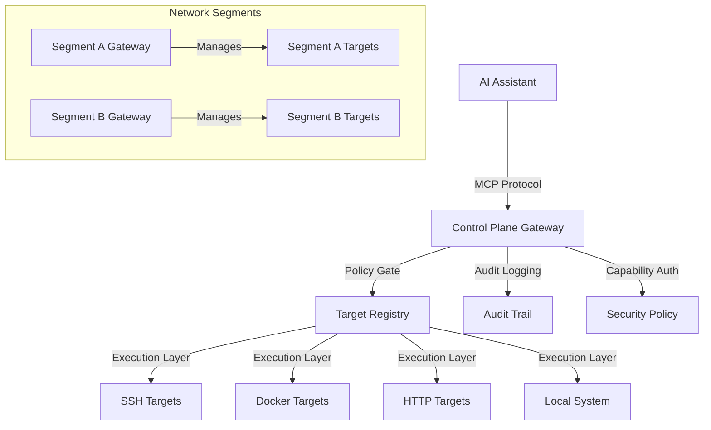

# TailOpsMCP Gateway

🛰️ **TailOpsMCP — A secure control plane gateway for managing distributed infrastructure**

> **Centralized management of multiple targets through a single control plane gateway — powered by MCP**
> Model Context Protocol (MCP) server that operates as a control plane gateway, managing SSH, Docker, and HTTP targets through capability-based authorization and policy enforcement.

[](https://opensource.org/licenses/MIT)
[](https://www.python.org/downloads/)
[](https://www.docker.com/)
[](https://www.proxmox.com/)
[](https://tailscale.com/)

[](https://github.com/mdlmarkham/TailOpsMCP/actions/workflows/quality-checks.yml)
[](https://github.com/mdlmarkham/TailOpsMCP/actions/workflows/security-scan.yml)
[](https://github.com/mdlmarkham/TailOpsMCP/actions/workflows/test.yml)
[](https://github.com/mdlmarkham/TailOpsMCP/actions/workflows/pre-commit.yml)

---

## 🎯 What is TailOpsMCP?

TailOpsMCP is a control plane gateway that centralizes management of distributed infrastructure through AI assistants like Claude, ChatGPT, or any MCP-compatible client. Instead of deploying agents on every node, you deploy a single gateway that manages multiple targets through SSH, Docker, and HTTP connections.

**Key Operational Model:**
- **Control Plane Gateway**: Single trusted node manages multiple targets
- **Target Registry**: Central configuration of managed systems
- **Policy Gate**: Capability-based authorization prevents "LLM imagination" risk
- **Execution Layer**: Orchestrates commands across different target types

Instead of remembering complex commands, just ask:

- *"Deploy my monitoring stack to all web servers"*
- *"Analyze security logs across the production cluster"*
- *"What's using all the CPU across all database nodes?"*
- *"Update packages on all staging servers"*

Perfect for **infrastructure teams**, **SREs**, and **DevOps engineers** managing distributed systems across multiple environments.

---

## 🚀 Quick Start

### **Proxmox One-Liner Deployment (Recommended)**

Deploy TailOpsMCP Gateway with a single command:

```bash
bash -c "$(curl -fsSL https://raw.githubusercontent.com/mdlmarkham/TailOpsMCP/master/ct/tailops-gateway.sh)"
```

**What this does:**
- ✅ Creates isolated LXC container with sensible defaults
- ✅ Installs TailOpsMCP with all dependencies
- ✅ Configures for Tailscale and Docker integration
- ✅ Starts the gateway service automatically
- ✅ Provides clear access instructions

**Customize deployment:**
```bash
# High-performance deployment
RAM_SIZE=4096 CPU_CORES=4 DISK_SIZE=16 \
bash -c "$(curl -fsSL https://raw.githubusercontent.com/mdlmarkham/TailOpsMCP/master/ct/tailops-gateway.sh)"

# Minimal deployment
RAM_SIZE=1024 CPU_CORES=1 DISK_SIZE=4 \
bash -c "$(curl -fsSL https://raw.githubusercontent.com/mdlmarkham/TailOpsMCP/master/ct/tailops-gateway.sh)"
```

### **Alternative: Legacy Proxmox Installer**

For existing workflows, the legacy installer is still available:

```bash
# Legacy Proxmox installer
bash -c "$(wget -qLO - https://raw.githubusercontent.com/mdlmarkham/TailOpsMCP/master/ct/build.func)"
```

This creates an isolated gateway container with:
- Debian 12 LXC (2GB RAM, 2 CPU cores, 8GB disk)
- Python 3.12 and all dependencies
- Tailscale OAuth authentication
- Systemd service configuration

---

## 👨‍💻 Development

### **Quick Development Setup**

```bash
# Clone the repository
git clone https://github.com/mdlmarkham/TailOpsMCP.git
cd TailOpsMCP

# Set up complete development environment
make setup

# Run all quality checks
make quality

# Run tests
make test

# Fix code issues automatically
make fix
```

### **Development Environment**

TailOpsMCP includes a comprehensive development environment with:

- **🔧 Code Quality Tools**: ruff, mypy, bandit, safety, isort, black
- **🧪 Testing Framework**: pytest with coverage reporting
- **🛡️ Security Scanning**: Automated security vulnerability detection
- **📝 Pre-commit Hooks**: Automatic quality checks before commits
- **📊 Complexity Analysis**: radon for code maintainability metrics
- **🔄 CI/CD Pipeline**: Automated quality checks and testing

**For detailed development setup and workflow, see [DEVELOPER_SETUP.md](DEVELOPER_SETUP.md)**

### **Quality Standards**

Our code quality system ensures:
- **✅ Automated Quality Checks**: Every commit runs comprehensive quality checks
- **🛡️ Security First**: Continuous security scanning for vulnerabilities
- **📈 Code Coverage**: Minimum 80% test coverage requirement
- **🔧 Auto-Fix Tools**: Automated fixing of common issues
- **📚 Comprehensive Documentation**: Full documentation for all tools

### **Available Commands**

| Command | Description |
|---------|-------------|
| `make setup` | Set up complete development environment |
| `make quality` | Run all quality checks (lint, typecheck, security, complexity) |
| `make lint` | Run ruff linting |
| `make format` | Format code with ruff and isort |
| `make typecheck` | Run mypy type checking |
| `make security` | Run security scans (bandit, safety) |
| `make complexity` | Run complexity analysis |
| `make test` | Run tests with coverage |
| `make fix` | Auto-fix code issues |
| `make ci` | Run CI pipeline (quality + tests) |
| `make clean` | Clean up generated files and caches |

**For complete command reference, see [QUALITY_TOOLS_REFERENCE.md](QUALITY_TOOLS_REFERENCE.md)**

### **Automation Scripts**

| Script | Purpose |
|--------|---------|
| `scripts/run_quality_checks.py` | Comprehensive quality checks runner |
| `scripts/fix_code_quality.py` | Auto-fix code quality issues |
| `scripts/setup_dev_environment.sh` | Complete development environment setup |

**For detailed automation documentation, see [CODE_QUALITY.md](CODE_QUALITY.md)**

---

## ✨ Key Features

### 🚀 **Current Capabilities**

#### **Control Plane Architecture**
- ✅ **Target Registry** - Central configuration of SSH, Docker, and HTTP targets
- ✅ **Policy Gate** - Capability-based authorization with parameter validation
- ✅ **Execution Layer** - Orchestrates commands across multiple target types
- ✅ **Multi-Target Operations** - Execute commands across groups of targets

#### **Target Management**
- ✅ **SSH Target Support** - Manage remote systems via SSH connections
- ✅ **Docker Socket Access** - Control Docker hosts through socket connections
- ✅ **HTTP API Integration** - Interact with web services and APIs
- ✅ **Local System Management** - Manage the gateway host itself

#### **Security & Operations**
- ✅ **Capability-Based Authorization** - Prevent "LLM imagination" risk through explicit allowlisting
- ✅ **Parameter Validation** - Enforce constraints on operation parameters
- ✅ **Audit Logging** - Comprehensive tracking of all gateway operations
- ✅ **Multi-Gateway Support** - Redundant gateways for high availability

### 🔒 **Security First**

⚠️ **[Read the Security Advisory](./docs/SECURITY_ADVISORY.md)** before production deployment

- ✅ **Tailscale Required** - Encrypted transport mandatory (no built-in TLS)
- ✅ **OAuth 2.1 with TSIDP** - Tailscale Identity Provider authentication
- ✅ **Non-Root Service** - Runs as dedicated `tailopsmcp` user
- ✅ **Systemd Hardening** - Full sandboxing with ProtectSystem, ProtectHome
- ✅ **Audit Logging** - Complete tracking of all operations
- ✅ **Scope-Based Access** - Fine-grained permission control
- ⚠️ **Approval Gates** - Requires external webhook (not built-in)

### 🔮 **Roadmap** (See [HOMELAB_FEATURES.md](./HOMELAB_FEATURES.md))

- 🔄 **LXC Network Auditing** - Review and audit container network configs
- 🔄 **Backup & Snapshots** - Automated backups with verification
- 🔄 **Certificate Management** - Let's Encrypt automation
- 🔄 **Reverse Proxy Management** - Traefik/Nginx/Caddy configuration
- 🔄 **Proxmox API Integration** - Full VM/container management
- 🔄 **Security Scanning** - Container vulnerability detection

---

## 🏗️ Control Plane Gateway Architecture



### **Architecture Overview**

**Control Plane Gateway Model:**
- **Single Gateway**: One trusted node manages multiple targets
- **Target Registry**: Central configuration of managed systems
- **Policy Enforcement**: Capability-based authorization prevents unauthorized operations
- **Execution Orchestration**: Commands routed to appropriate targets

**Security Benefits:**
- **Reduced Blast Radius**: Compromise affects only gateway, not all targets
- **Capability Allowlisting**: Explicit authorization prevents "LLM imagination" risk
- **Segment Isolation**: Gateways can be deployed per network segment
- **Audit Trail**: Comprehensive logging of all gateway operations

**Operational Model:**
- **Gateway Deployment**: Typically runs in Proxmox LXC containers for isolation
- **Target Connectivity**: SSH keys, Docker sockets, HTTP APIs for target access
- **Redundancy**: Multiple gateways can manage overlapping target sets
- **Maintenance**: Single point of control for updates and configuration

---

## 🐳 Gateway Deployment & Management

### **Proxmox LXC Gateway Deployment**

TailOpsMCP gateways are typically deployed in Proxmox LXC containers for isolation and security.

#### **Recommended LXC Configuration**

```bash
# /etc/pve/lxc/103.conf
arch: amd64
cores: 2
memory: 2048
net0: name=eth0,bridge=vmbr0,firewall=1,ip=dhcp
rootfs: local-lvm:vm-103-disk-0,size=8G

# Enable Docker for target management
features: nesting=1,keyctl=1
lxc.apparmor.profile: unconfined
lxc.cgroup2.devices.allow: c 10:200 rwm  # /dev/net/tun for Tailscale
```

#### **Gateway Container Features**

- **Isolation**: LXC containers provide process and network isolation
- **Resource Control**: CPU and memory limits prevent gateway resource exhaustion
- **Security**: AppArmor profiles and cgroup device controls
- **Network Access**: Tailscale integration for secure remote access

### **Multi-Gateway Deployment Strategy**

#### **Segment-Based Deployment**

Deploy gateways per network segment to limit blast radius:

```yaml
# Production Segment A
production-a-gateway:
  segment: "production-a"
  targets: ["web-a-01", "db-a-01", "cache-a-01"]

# Production Segment B
production-b-gateway:
  segment: "production-b"
  targets: ["web-b-01", "db-b-01", "cache-b-01"]

# Staging Segment
staging-gateway:
  segment: "staging"
  targets: ["staging-web-01", "staging-db-01"]
```

#### **Redundancy Configuration**

Multiple gateways can manage overlapping target sets:

```yaml
# Primary gateway for production
primary-gateway:
  targets: ["web-01", "db-01", "cache-01", "monitoring-01"]

# Secondary gateway for redundancy
secondary-gateway:
  targets: ["web-01", "db-01", "cache-01", "logging-01"]
```

### **Gateway Maintenance Procedures**

#### **Updates & Upgrades**

```bash
# Update gateway software
sudo systemctl stop tailopsmcp-mcp
cd /opt/tailopsmcp
git pull
pip install -r requirements.txt
sudo systemctl start tailopsmcp-mcp

# Verify gateway health
sudo systemctl status tailopsmcp-mcp
sudo journalctl -u tailopsmcp-mcp --since "5 minutes ago"
```

#### **Target Registry Management**

```bash
# Backup target registry
cp targets.yaml targets.yaml.backup.$(date +%Y%m%d_%H%M%S)

# Validate configuration
tailopsmcp-mcp --validate-config targets.yaml

# Reload gateway configuration
sudo systemctl reload tailopsmcp-mcp
```

---

## 🔐 Security & Connectivity

### **Tailscale Integration for Gateway Security**

TailOpsMCP uses **Tailscale Identity Provider (TSIDP)** for OAuth 2.1 authentication, providing secure gateway access control.

#### **Gateway Network Security**

Configure Tailscale ACLs to control gateway access:

```json
{
  "acls": [
    {
      "action": "accept",
      "src": ["group:tailopsmcp-admins"],
      "dst": ["tag:tailopsmcp-gateway:8080"]
    }
  ],
  "tagOwners": {
    "tag:tailopsmcp-gateway": ["group:tailopsmcp-admins"]
  }
}
```

#### **Target Network Connectivity**

Ensure gateways can reach targets through Tailscale:

- **Subnet Routes**: Configure Tailscale subnet routes for cross-network access
- **ACL Rules**: Allow gateway-to-target communication
- **Service Tags**: Use tags for gateway service discovery

### **Gateway-to-Target Connectivity**

#### **SSH Target Requirements**
- Network connectivity between gateway and target
- SSH key authentication configured
- Firewall rules allowing SSH access
- Tailscale subnet routes if crossing networks

#### **Docker Target Requirements**
- Docker socket access or API endpoint reachable
- Network connectivity to Docker host
- API token authentication if using remote API

#### **HTTP Target Requirements**
- Network connectivity to API endpoint
- Authentication credentials (API keys, tokens)
- TLS/SSL certificate validation

### **Multi-Gateway Network Design**

For segment isolation and redundancy:

```yaml
# Segment A Gateway
segment-a-gateway:
  network_segment: "production-a"
  targets: ["web-a-01", "db-a-01", "cache-a-01"]

# Segment B Gateway
segment-b-gateway:
  network_segment: "production-b"
  targets: ["web-b-01", "db-b-01", "cache-b-01"]

# Overlapping targets for redundancy
shared-targets: ["monitoring-01", "logging-01"]
```

---

## 📚 Documentation

### **Development Documentation**
- **[DEVELOPER_SETUP.md](DEVELOPER_SETUP.md)** - Complete development environment setup
- **[CODE_QUALITY.md](CODE_QUALITY.md)** - Comprehensive code quality guide
- **[QUALITY_TOOLS_REFERENCE.md](QUALITY_TOOLS_REFERENCE.md)** - Technical reference for all tools

### **Project Documentation**
- **[CONTRIBUTING.md](CONTRIBUTING.md)** - Contributing guidelines
- **[SECURITY_REVIEW_REPORT.md](SECURITY_REVIEW_REPORT.md)** - Security review results
- **[HOMELAB_FEATURES.md](HOMELAB_FEATURES.md)** - Feature roadmap and specifications

### **Technical Specifications**
- **[Specs Directory](specs/)** - Detailed technical specifications
- **[Examples Directory](examples/)** - Usage examples and demonstrations
- **[Plans Directory](plans/)** - Implementation plans and architecture

---

## 🤝 Contributing

We welcome contributions! Please see our [Contributing Guidelines](CONTRIBUTING.md) for details.

### **Development Workflow**

1. **Fork and Clone**: Fork the repository and clone locally
2. **Setup Environment**: Run `make setup` to set up development environment
3. **Create Feature Branch**: Create a feature branch for your changes
4. **Develop**: Make your changes with tests
5. **Quality Checks**: Run `make quality` to ensure code quality
6. **Submit PR**: Submit a pull request with clear description

### **Code Quality Requirements**

All contributions must:
- ✅ Pass all quality checks (`make quality`)
- ✅ Include comprehensive tests
- ✅ Follow security best practices
- ✅ Include documentation for new features
- ✅ Maintain backward compatibility

---

## 📄 License

This project is licensed under the MIT License - see the [LICENSE](LICENSE) file for details.

---

## 🔗 Links

- **Repository**: [https://github.com/mdlmarkham/TailOpsMCP](https://github.com/mdlmarkham/TailOpsMCP)
- **Documentation**: [https://mdlmarkham.github.io/TailOpsMCP](https://mdlmarkham.github.io/TailOpsMCP)
- **Issues**: [https://github.com/mdlmarkham/TailOpsMCP/issues](https://github.com/mdlmarkham/TailOpsMCP/issues)
- **Discussions**: [https://github.com/mdlmarkham/TailOpsMCP/discussions](https://github.com/mdlmarkham/TailOpsMCP/discussions)

---

## 🙏 Acknowledgments

- [Model Context Protocol (MCP)](https://modelcontextprotocol.io/) - The protocol that makes this possible
- [Tailscale](https://tailscale.com/) - Secure network connectivity
- [Proxmox](https://www.proxmox.com/) - Virtualization platform
- [Python Community](https://www.python.org/) - Amazing ecosystem of tools and libraries