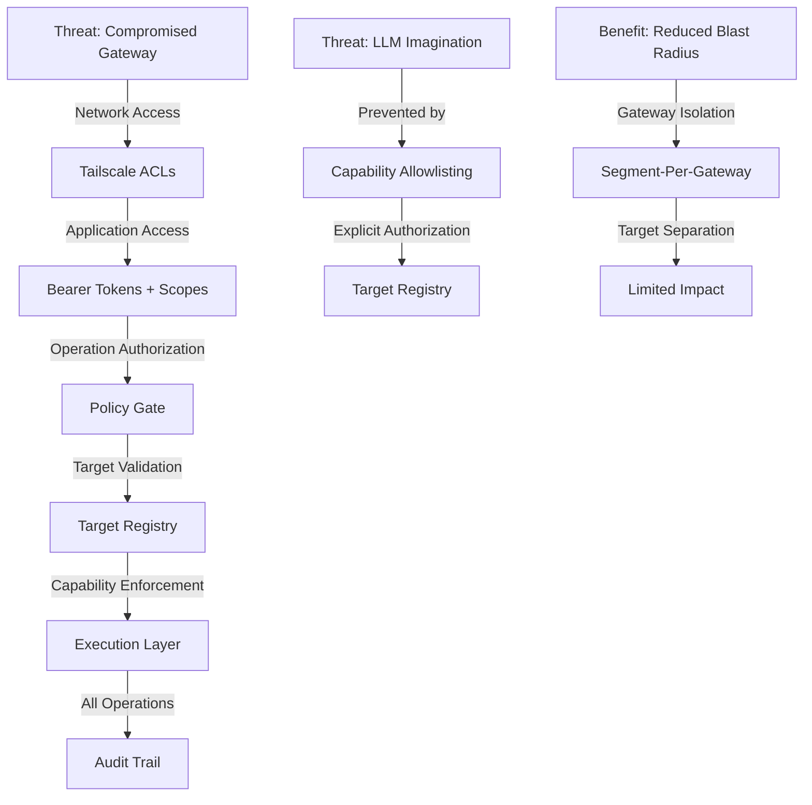

# Security Model for Control Plane Gateway

## Overview

# Security Architecture

SystemManager implements **defense-in-depth** security for control plane gateway deployments:

1. **Network Layer**: Tailscale ACLs control WHO can reach the gateway
2. **Application Layer**: Bearer tokens + scopes control WHAT they can do
3. **Policy Gate**: Capability-based authorization prevents "LLM imagination" risk
4. **Target Registry**: Explicit allowlisting of managed systems
5. **Audit Layer**: Comprehensive logging tracks WHO did WHAT WHERE

**Critical**: Gateway access ≠ target access. All operations are explicitly authorized.

## Control Plane Gateway Trust Model

### **One Trusted Node Per Network Segment**

The control plane gateway architecture reduces operational overhead by deploying **one trusted node per network segment** rather than agents on every target.



### **Security Benefits of Control Plane Gateway**

#### **Reduced Blast Radius**
- **Segment Isolation**: Compromise affects only gateway, not all targets
- **Target Separation**: Gateways manage specific target groups
- **Network Segmentation**: Gateways deployed per network segment

#### **Capability-Based Authorization**
- **Explicit Allowlisting**: Only explicitly configured operations are permitted
- **Parameter Validation**: Operation parameters validated against constraints
- **LLM Imagination Prevention**: Prevents AI from "imagining" unauthorized operations

#### **Operational Security**
- **Single Point of Control**: Updates and configuration managed centrally
- **Audit Centralization**: All operations logged through gateway
- **Secrets Management**: Credentials stored only on gateway

## Control Plane Gateway Security Assumptions

### ⚠️ CRITICAL: Gateway Isolation is MANDATORY

**SystemManager gateways must be deployed in isolated environments** (Proxmox LXC containers, dedicated VMs, or secure jump hosts).

- ✅ **Safe**: Gateway running in isolated LXC container with Tailscale
- ❌ **UNSAFE**: Gateway running on production target systems
- ❌ **UNSAFE**: Gateway with broad network access to all targets
- ❌ **UNSAFE**: Gateway without proper credential isolation

### **Gateway-to-Target Connectivity Security**

#### **SSH Target Security**
- ✅ **Safe**: SSH keys stored securely on gateway with limited permissions
- ❌ **UNSAFE**: SSH keys with root access to all targets
- ❌ **UNSAFE**: SSH keys stored insecurely or shared across gateways

#### **Docker Target Security**
- ✅ **Safe**: Docker socket access with limited container capabilities
- ❌ **UNSAFE**: Docker socket with full root-equivalent access
- ❌ **UNSAFE**: Docker API tokens with broad permissions

#### **HTTP Target Security**
- ✅ **Safe**: API tokens with least-privilege scopes
- ❌ **UNSAFE**: API tokens with administrative permissions
- ❌ **UNSAFE**: API tokens stored in plaintext configuration

### **Policy Gate Security Controls**

#### **Capability Allowlisting**
- ✅ **Safe**: Only explicitly configured capabilities are permitted
- ❌ **UNSAFE**: Broad capabilities that allow "LLM imagination" risk
- ❌ **UNSAFE**: Capabilities without parameter validation

#### **Target Registry Validation**
- ✅ **Safe**: Targets explicitly defined in registry with constraints
- ❌ **UNSAFE**: Dynamic target discovery without validation
- ❌ **UNSAFE**: Targets without capability restrictions

### **Multi-Gateway Security Benefits**

#### **Segment Isolation**
- **Reduced Blast Radius**: Compromise affects only gateway segment
- **Target Separation**: Gateways manage specific target groups
- **Network Segmentation**: Gateways deployed per network segment

#### **Redundancy Security**
- **Failover Capability**: Multiple gateways can manage critical targets
- **Load Distribution**: Operations spread across gateways
- **Maintenance Isolation**: Update gateways without affecting all targets

## Policy Gate & Capability-Based Authorization

### **Capability-Based Authorization Model**

The Policy Gate enforces security through explicit capability allowlisting, preventing "LLM imagination" risk where AI assistants might attempt unauthorized operations.

#### **Target Registry Capabilities**

Each target in the registry defines explicit capabilities:

```yaml
# Example target with limited capabilities
web-server-01:
  id: "web-server-01"
  capabilities:
    - "system:read"      # View system metrics
    - "network:read"     # Check network status
    - "container:read"   # List containers
  constraints:
    sudo_policy: "none"  # No sudo access

# Example target with broader capabilities
docker-host-01:
  id: "docker-host-01"
  capabilities:
    - "system:read"
    - "container:read"
    - "container:control"  # Start/stop containers
    - "stack:deploy"       # Deploy Docker stacks
  constraints:
    sudo_policy: "limited"  # Limited sudo access
```

#### **Policy Gate Enforcement**

```python
# Policy Gate validates every operation
await policy_gate.authorize(
    operation="restart_container",
    target="docker-host-01",
    tier="control",
    parameters={"container": "nginx"}
)

# Authorization checks:
# 1. Target exists in registry
# 2. Target has required capability
# 3. Operation parameters are valid
# 4. User has appropriate scopes
# 5. Operation is within constraints
```

### **Security Benefits**

#### **LLM Imagination Prevention**
- **Explicit Allowlisting**: AI can only perform explicitly configured operations
- **Parameter Validation**: Operation parameters validated against constraints
- **Target Isolation**: Operations limited to specific targets

#### **Defense in Depth**
- **Network Layer**: Tailscale ACLs control gateway access
- **Application Layer**: Bearer tokens control user access
- **Policy Layer**: Capability allowlisting controls operation access
- **Target Layer**: Target-specific constraints limit impact

### **Tool Risk Levels with Policy Gate**

| Risk Level | Examples | Policy Gate Controls |
|------------|----------|---------------------|
| **low** | get_system_status, list_containers | Target capability validation |
| **moderate** | ping_host, dns_lookup | Network access validation |
| **high** | manage_container, file_operations | Capability + parameter validation |
| **critical** | install_package, pull_docker_image | Multi-layer approval + validation |

## Configuration

### Environment Variables

```bash
# Authentication
SYSTEMMANAGER_REQUIRE_AUTH=true          # Enforce bearer tokens
SYSTEMMANAGER_SHARED_SECRET=your-secret  # HMAC secret for tokens
SYSTEMMANAGER_JWT_SECRET=jwt-secret      # Or use JWT

# Approval System
SYSTEMMANAGER_ENABLE_APPROVAL=true       # Enable approval gates
SYSTEMMANAGER_APPROVAL_WEBHOOK=https://approval.example.com

# Audit Logging
SYSTEMMANAGER_AUDIT_LOG=/var/log/systemmanager/audit.log
```

### Recommended Tailscale ACL

```jsonc
{
  "tagOwners": {
    "tag:systemmanager-server": ["group:ops"],
    "tag:systemmanager-client": ["group:ops", "group:automation"],
  },
  
  "acls": [
    // Only tagged clients can reach the MCP server
    {
      "action": "accept",
      "src": ["tag:systemmanager-client"],
      "dst": ["tag:systemmanager-server:8080"],
    },
    
    // Deny everything else
    {
      "action": "deny",
      "src": ["*"],
      "dst": ["tag:systemmanager-server:*"],
    },
  ],
  
  "services": {
    "svc:systemmanager-mcp": {
      "protocol": "tcp",
      "port": 8080,
      "tags": ["tag:systemmanager-server"],
      "allowedTags": ["tag:systemmanager-client"],
    },
  },
}
```

### Token Generation

Create tokens with scopes using `scripts/mint_token.py`:

```bash
# Read-only token (safe for monitoring)
python scripts/mint_token.py \
  --agent "grafana-datasource" \
  --scopes "readonly" \
  --ttl 30d

# Admin token (use sparingly, short TTL)
python scripts/mint_token.py \
  --agent "ops-automation" \
  --scopes "admin" \
  --ttl 1h

# Custom scopes (principle of least privilege)
python scripts/mint_token.py \
  --agent "container-manager" \
  --scopes "container:read,container:write,network:read" \
  --ttl 7d
```

## Audit Log Analysis

### Example Audit Record

```json
{
  "timestamp": "2025-11-15T20:30:00Z",
  "tool": "install_package",
  "subject": "ops-automation",
  "args": {"package_name": "nginx", "auto_approve": true},
  "result_status": "success",
  "scopes": ["admin"],
  "risk_level": "critical",
  "approved": true,
  "tailscale": {
    "tailscale_node": "dev1",
    "tailscale_user": "alice@example.com",
    "tailscale_tags": ["tag:systemmanager-client"],
    "tailnet": "example.ts.net"
  }
}
```

### Monitoring Queries

```bash
# Find all critical operations
jq 'select(.risk_level == "critical")' /var/log/systemmanager/audit.log

# Find operations by a specific Tailscale user
jq 'select(.tailscale.tailscale_user == "alice@example.com")' audit.log

# Find failed authorization attempts (lateral movement detection)
jq 'select(.result_status == "error" and .error | contains("Insufficient"))' audit.log

# Find unapproved critical operations
jq 'select(.risk_level == "critical" and .approved == false)' audit.log
```

### Integration with Tailscale Flow Logs

Combine application audit logs with Tailscale network logs:

1. Enable Tailscale flow logs in admin console
2. Correlate by timestamp + source IP + tailnet user
3. Detect anomalies:
   - Network connection without successful auth
   - Multiple auth failures from same node
   - Unusual source node for specific tools

## Control Plane Gateway Deployment Checklist

### **Gateway Deployment Security**

#### **Minimum Security (Development)**

- [x] Deploy gateway in isolated LXC container
- [x] Configure Tailscale ACLs for gateway access
- [x] Define target registry with limited capabilities
- [ ] Use `readonly` scope for monitoring tools
- [ ] Configure target-specific constraints

#### **Recommended Security (Production)**

- [x] All of minimum security
- [ ] Deploy multiple gateways per network segment
- [ ] Configure overlapping target sets for redundancy
- [ ] Set `SYSTEMMANAGER_REQUIRE_AUTH=true`
- [ ] Generate scoped tokens with short TTLs
- [ ] Tag gateway with `tag:systemmanager-gateway`
- [ ] Only allow `tag:systemmanager-client` to connect
- [ ] Monitor gateway audit logs daily
- [ ] Rotate gateway tokens monthly
- [ ] Validate target registry configuration regularly

#### **Maximum Security (Critical Infrastructure)**

- [x] All of recommended security
- [ ] Deploy gateways with segment isolation
- [ ] Implement approval webhook for critical operations
- [ ] Use separate tokens per gateway segment
- [ ] Token TTL ≤ 24 hours for critical gateways
- [ ] Send gateway audit logs to SIEM
- [ ] Alert on gateway authorization failures
- [ ] Correlate with Tailscale flow logs
- [ ] Review gateway audit trail weekly
- [ ] Implement "break glass" procedure for gateway emergencies

### **Target Registry Security**

#### **Capability Allowlisting Best Practices**

- [ ] Define explicit capabilities per target
- [ ] Use least-privilege principle for capabilities
- [ ] Validate operation parameters against constraints
- [ ] Regularly review and update target capabilities
- [ ] Test capability enforcement with dry-run mode

#### **Target Connectivity Security**

- [ ] Store SSH keys securely with limited permissions
- [ ] Use Docker socket access with container constraints
- [ ] Configure API tokens with least-privilege scopes
- [ ] Rotate target credentials regularly
- [ ] Monitor target connectivity health

## Threat Scenarios

### 1. Compromised Tailnet Node

**Attack**: Attacker compromises a node already in your tailnet

**Mitigations**:
1. Tailscale ACL denies access (must be tagged appropriately)
2. Bearer token required (attacker doesn't have it)
3. Audit log shows connection from unexpected node

### 2. Leaked Bearer Token

**Attack**: Token leaked via logs, config file, environment variable

**Mitigations**:
1. Token has limited scopes (principle of least privilege)
2. Token expires quickly (short TTL)
3. Audit log shows usage from unexpected Tailscale user/node
4. Approval required for critical operations

### 3. Insider Threat (Legitimate User)

**Attack**: Authorized user attempts malicious operation

**Mitigations**:
1. Scopes limit what token can do
2. Critical operations require approval
3. Audit log records who did what with Tailscale identity
4. Tailscale flow logs provide additional evidence

### 4. SSRF via http_request_test

**Attack**: Use http_request_test to scan internal network

**Mitigations**:
1. Tool requires `network:diag` scope
2. Tool marked as `requires_approval=true`
3. Implement URL allowlist in production
4. Audit log tracks all HTTP requests made

## Incident Response

If you detect suspicious activity:

1. **Immediate**: Revoke compromised token (update `SYSTEMMANAGER_SHARED_SECRET`)
2. **Immediate**: Review recent audit logs for scope of compromise
3. **Within 1 hour**: Check Tailscale flow logs for lateral movement
4. **Within 4 hours**: Rotate all tokens
5. **Within 24 hours**: Review and strengthen ACLs
6. **Post-mortem**: Update monitoring/alerting based on lessons learned

## Future Enhancements

Planned security improvements:

- [ ] mTLS client certificates
- [ ] Integration with external IdP (Okta, Azure AD)
- [ ] Real-time alerting on critical operations
- [ ] Webhook-based approval workflows
- [ ] Path-based file access controls
- [ ] Rate limiting per token
- [ ] Token usage analytics
- [ ] Automated token rotation

## References

- [Tailscale ACLs Documentation](https://tailscale.com/kb/1018/acls/)
- [Tailscale Services Guide](./TAILSCALE_SERVICES.md)
- [Token Authentication Implementation](../src/auth/token_auth.py)
- [Scope Definitions](../src/auth/scopes.py)
- [Audit Logger](../src/utils/audit.py)
