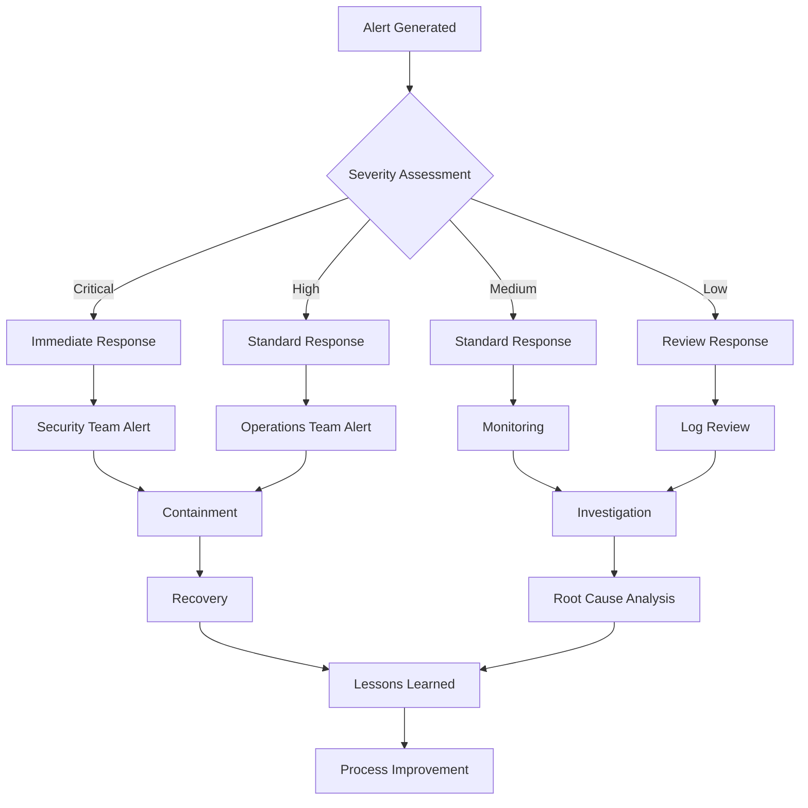

# TailOpsMCP Security Configuration Guide

This comprehensive guide provides detailed instructions for configuring, deploying, and operating the TailOpsMCP security and identity control system. The enhanced security framework provides enterprise-grade security capabilities with comprehensive audit trails, threat detection, and compliance automation.

## Table of Contents

1. [Identity and Access Management](#identity-and-access-management)
2. [Audit and Compliance](#audit-and-compliance)
3. [Security Monitoring](#security-monitoring)
4. [Security Best Practices](#security-best-practices)
5. [Configuration Reference](#configuration-reference)
6. [Deployment Guide](#deployment-guide)
7. [Operations and Maintenance](#operations-and-maintenance)

---

## Identity and Access Management

### Tailscale OIDC Integration Setup

The TailOpsMCP system integrates with Tailscale's OIDC provider for seamless identity management:

#### Prerequisites
- Tailscale account with admin privileges
- OIDC application configured in Tailscale
- Valid certificate and domain for callback URLs

#### Configuration Steps

1. **Configure Tailscale OIDC Application**
   ```bash
   # In Tailscale admin console:
   # 1. Go to Settings > Integrations
   # 2. Create new OIDC application
   # 3. Set callback URL: https://your-domain.com/auth/callback
   # 4. Note Client ID and Client Secret
   ```

2. **Environment Variables Setup**
   ```bash
   # Add to your .env file
   TAILSCALE_OIDC_CLIENT_ID=your_client_id
   TAILSCALE_OIDC_CLIENT_SECRET=your_client_secret
   TAILSCALE_OIDC_ISSUER=https://login.tailscale.com
   TAILSCALE_REDIRECT_URI=https://your-domain.com/auth/callback
   ```

3. **Database Schema Initialization**
   ```sql
   -- Initialize security database
   sqlite3 security.db < config/security_database_schema.sql
   ```

#### Identity Context Mapping

The system automatically maps Tailscale identities to system roles:

```python
# Example identity mapping
{
    "user_id": "ts_user_123",
    "username": "john.doe@company.com",
    "email": "john.doe@company.com",
    "groups": ["engineering", "production-access"],
    "roles": ["developer", "operations"],
    "tailscale_node": "johns-laptop",
    "risk_profile": "standard"
}
```

### Multi-Factor Authentication Configuration

MFA is enforced for high-risk operations and privileged roles:

#### MFA Policy Configuration

```yaml
security:
  identity_management:
    mfa_required_roles: ["admin", "operations", "security"]
    mfa_required_operations: ["deploy_production", "access_sensitive_data"]
    mfa_enforcement: true
    mfa_methods: ["totp", "webauthn", "sms"]
    mfa_session_timeout: 300  # 5 minutes
```

#### Setting Up TOTP MFA

```python
# Generate TOTP secret for user
from src.services.identity_manager import IdentityManager

identity_manager = IdentityManager()
await identity_manager.setup_totp_mfa(user_id="user123")
```

### Role-Based Access Control Setup

#### Role Definitions

```yaml
security:
  access_control:
    roles:
      admin:
        permissions: ["*"]
        mfa_required: true
        session_timeout: 1800

      operations:
        permissions: ["deploy", "monitor", "manage_fleet"]
        mfa_required: true
        session_timeout: 3600

      developer:
        permissions: ["read_inventory", "deploy_dev"]
        mfa_required: false
        session_timeout: 7200

      viewer:
        permissions: ["read_only"]
        mfa_required: false
        session_timeout: 14400
```

#### Permission Matrix

| Resource | Admin | Operations | Developer | Viewer |
|----------|-------|------------|-----------|---------|
| Fleet Inventory | Full | Read/Manage | Read | Read |
| Deployments | Full | Production | Dev Only | Read |
| Security Logs | Full | Security Events | Own Events | Read |
| Policy Management | Full | Review | None | None |

### Session Management Policies

#### Session Configuration

```yaml
security:
  identity_management:
    session_timeout: 3600  # 1 hour default
    max_concurrent_sessions: 3
    session_validation_interval: 300  # 5 minutes
    session_encryption: true
    session_storage: "secure_db"
```

#### Session Security Features

- **Token Validation**: Every API request validates session token
- **Session Renewal**: Tokens refreshed automatically on activity
- **Concurrent Session Limits**: Prevent session hijacking
- **Device Binding**: Sessions bound to Tailscale node identity

---

## Audit and Compliance

### Audit Log Configuration and Retention

#### Audit Logging Setup

```yaml
security:
  audit_logging:
    enabled: true
    retention_days: 2555  # 7 years for compliance
    encryption_enabled: true
    real_time_processing: true
    log_levels: ["info", "warning", "error", "critical"]

  audit_storage:
    database: "sqlite:///security.db"
    encryption_key: "${AUDIT_ENCRYPTION_KEY}"
    compression: true
    archival: true
```

#### Audit Event Types

| Event Type | Description | Compliance Standard |
|------------|-------------|-------------------|
| Authentication | Login/logout events | SOC2, ISO27001 |
| Authorization | Access control decisions | SOC2, ISO27001 |
| Data Access | Sensitive data access | PCI-DSS, GDPR |
| Configuration Changes | System configuration | ISO27001 |
| Security Events | Threats, violations | All standards |
| Workflow Operations | Workflow executions | SOC2 |

#### Audit Query Examples

```python
# Get user authentication history
from src.services.security_audit_logger import SecurityAuditLogger

audit_logger = SecurityAuditLogger()
events = await audit_logger.get_audit_events({
    "event_type": "authentication",
    "user_id": "user123",
    "time_range": "24h"
})

# Get policy violations
violations = await audit_logger.get_policy_violations({
    "severity": "high",
    "time_range": "7d"
})
```

### Compliance Standard Implementation

#### SOC2 Compliance

**Trust Service Criteria Coverage:**
- Security: ✅ Access controls, encryption, monitoring
- Availability: ✅ System monitoring, incident response
- Processing Integrity: ✅ Workflow validation, data integrity
- Confidentiality: ✅ Data classification, encryption
- Privacy: ✅ Personal data protection, consent management

```yaml
compliance:
  soc2:
    enabled: true
    criteria:
      - "security"
      - "availability"
      - "processing_integrity"
      - "confidentiality"
      - "privacy"
    evidence_collection: true
    automated_testing: true
```

#### ISO 27001 Compliance

**Control Implementation:**
- A.9.2.1: User registration process ✅
- A.9.2.2: User access provisioning ✅
- A.9.4.1: Information access restriction ✅
- A.12.4.1: Event logging ✅
- A.16.1.1: Incident management ✅

```yaml
compliance:
  iso27001:
    enabled: true
    controls:
      - "A.9.2.1"
      - "A.9.2.2"
      - "A.9.4.1"
      - "A.12.4.1"
      - "A.16.1.1"
    risk_assessment: true
    continuous_monitoring: true
```

#### PCI-DSS Compliance

**Requirements Coverage:**
- Requirement 1: Firewalls ✅
- Requirement 2: System passwords ✅
- Requirement 3: Protect stored cardholder data ✅
- Requirement 4: Encrypt transmission ✅
- Requirement 7: Restrict access ✅
- Requirement 10: Log and monitor ✅

### Evidence Collection and Reporting

#### Automated Evidence Collection

```python
from src.services.compliance_framework import ComplianceFramework

compliance = ComplianceFramework()
await compliance.collect_evidence("SOC2", "2024-12-01", "2024-12-31")
```

#### Compliance Reports

- **Executive Summary**: High-level compliance status
- **Technical Evidence**: Detailed audit logs and configurations
- **Gap Analysis**: Identified compliance gaps and remediation
- **Remediation Plan**: Action items and timelines

#### Report Generation

```bash
# Generate SOC2 compliance report
curl -X POST https://your-domain.com/api/compliance/report \
  -H "Authorization: Bearer $TOKEN" \
  -d '{"standard": "SOC2", "format": "pdf"}'

# Generate ISO 27001 assessment
curl -X POST https://your-domain.com/api/compliance/assessment \
  -H "Authorization: Bearer $TOKEN" \
  -d '{"standard": "ISO27001", "format": "json"}'
```

### Data Handling and Privacy Controls

#### Data Classification

| Classification | Description | Handling Requirements |
|----------------|-------------|----------------------|
| Public | No restrictions | Standard logging |
| Internal | Company internal | Access control |
| Confidential | Sensitive business | Encryption, audit |
| Restricted | Highly sensitive | MFA, encryption, monitoring |

#### Data Protection Controls

```yaml
security:
  data_protection:
    encryption:
      at_rest: "AES-256"
      in_transit: "TLS-1.3"
      key_management: "aws_kms"

    access_controls:
      classification_based: true
      need_to_know: true
      data_minimization: true

    privacy:
      gdpr_compliance: true
      data_retention: true
      right_to_be_forgotten: true
      consent_management: true
```

---

## Security Monitoring

### Threat Detection Configuration

#### Real-time Threat Detection

```yaml
security:
  security_monitoring:
    threat_detection_enabled: true
    detection_rules:
      brute_force:
        enabled: true
        threshold: 5
        time_window: 300  # 5 minutes

      privilege_escalation:
        enabled: true
        monitoring_privileged: true

      data_exfiltration:
        enabled: true
        volume_threshold: "100MB"
        frequency_threshold: 10
```

#### Threat Detection Rules

**Brute Force Detection**
- Monitor failed authentication attempts
- Track IP addresses and user agents
- Alert on threshold violations
- Automatic IP blocking

**Privilege Escalation Detection**
- Monitor permission changes
- Track admin role assignments
- Alert on unusual privilege usage
- Session monitoring

**Data Exfiltration Detection**
- Monitor data access patterns
- Track data volume and frequency
- Alert on unusual data flows
- Network traffic analysis

### Anomaly Detection Setup

#### Behavioral Analysis

```yaml
security:
  anomaly_detection:
    enabled: true
    learning_period: 30  # days
    sensitivity: "medium"
    metrics:
      - "login_times"
      - "access_patterns"
      - "data_usage"
      - "api_calls"
```

#### Machine Learning Models

- **Login Anomaly Detection**: Unusual login times/locations
- **Access Pattern Analysis**: Deviations from normal patterns
- **Data Usage Monitoring**: Unusual data access volumes
- **API Call Analysis**: Abnormal API usage patterns

### Security Alerting Policies

#### Alert Configuration

```yaml
security:
  security_monitoring:
    alerting:
      enabled: true
      channels:
        email:
          enabled: true
          recipients: ["security@company.com"]
        slack:
          enabled: true
          webhook_url: "${SLACK_WEBHOOK_URL}"
        pagerduty:
          enabled: true
          service_key: "${PAGERDUTY_KEY}"

      severity_mapping:
        critical: ["immediate", "email", "slack", "pagerduty"]
        high: ["immediate", "email", "slack"]
        medium: ["email", "slack"]
        low: ["email"]
```

#### Alert Response Matrix

| Severity | Response Time | Escalation | Auto-Remediation |
|----------|---------------|------------|------------------|
| Critical | 15 minutes | Immediate | Block IP, revoke sessions |
| High | 1 hour | 2 hours | Enhanced monitoring |
| Medium | 4 hours | 24 hours | Log and review |
| Low | 24 hours | 72 hours | Monitor only |

### Incident Response Procedures

#### Incident Classification

**Security Incident Types:**
- Data Breach
- Unauthorized Access
- Malware Detection
- Policy Violation
- System Compromise
- Service Disruption

#### Response Workflow



#### Automated Response Actions

```python
# Automated response to critical alerts
from src.services.security_monitor import SecurityMonitor

monitor = SecurityMonitor()
await monitor.handle_critical_alert(alert_id="alert_123")
```

---

## Security Best Practices

### Operational Security Guidelines

#### Security Principles

1. **Defense in Depth**: Multiple layers of security controls
2. **Zero Trust**: Never trust, always verify
3. **Principle of Least Privilege**: Minimal necessary access
4. **Separation of Duties**: Multiple people for critical operations
5. **Security by Design**: Security built into all processes

#### Operational Procedures

**Daily Security Tasks:**
- Review security dashboard
- Check for new alerts
- Monitor system health
- Verify backup integrity
- Update threat intelligence

**Weekly Security Tasks:**
- Review access permissions
- Analyze security trends
- Update security policies
- Conduct security training
- Test incident response

**Monthly Security Tasks:**
- Security posture assessment
- Compliance report review
- Security tool updates
- Vulnerability assessments
- Penetration testing

### Security Incident Response

#### Incident Response Team

- **Security Lead**: Overall incident coordination
- **Technical Lead**: Technical investigation and remediation
- **Communications Lead**: Internal/external communications
- **Legal Counsel**: Legal and regulatory compliance
- **Executive Sponsor**: Strategic decision making

#### Communication Protocols

```yaml
security:
  incident_response:
    team_contacts:
      security_lead: "+1-555-0101"
      technical_lead: "+1-555-0102"
      communications_lead: "+1-555-0103"
      legal_counsel: "+1-555-0104"

    escalation_matrix:
      level_1: "Technical Lead"
      level_2: "Security Lead"
      level_3: "Executive Sponsor"

    communication_channels:
      internal: "Slack #security-incidents"
      external: "Email security@company.com"
      executive: "Phone +1-555-0199"
```

### Data Classification and Handling

#### Classification Guidelines

**Public Data:**
- Marketing materials
- Public documentation
- General company information

**Internal Data:**
- Employee directories
- Internal procedures
- Non-sensitive business data

**Confidential Data:**
- Financial information
- Customer data
- Strategic plans
- System configurations

**Restricted Data:**
- Personal identifiable information (PII)
- Payment card data
- Trade secrets
- Security configurations

#### Data Handling Procedures

```python
# Example data handling workflow
from src.services.data_protection import DataProtection

dp = DataProtection()

# Classify data
classification = await dp.classify_data(data_item)

# Apply protection controls
protection_level = await dp.apply_protection_controls(
    classification=classification,
    data_type=data_type
)

# Audit access
await dp.audit_data_access(
    user_id=user_id,
    data_id=data_id,
    action="read"
)
```

### Network Security Controls

#### Network Segmentation

```yaml
network:
  segmentation:
    production:
      vlan: 100
      access: "restricted"
      monitoring: "comprehensive"

    staging:
      vlan: 200
      access: "controlled"
      monitoring: "standard"

    development:
      vlan: 300
      access: "open"
      monitoring: "basic"

    management:
      vlan: 400
      access: "admin_only"
      monitoring: "comprehensive"
```

#### Firewall Rules

```bash
# Production environment firewall rules
iptables -A INPUT -i eth0 -p tcp --dport 443 -s 10.0.0.0/8 -j ACCEPT
iptables -A INPUT -i eth0 -p tcp --dport 22 -s 192.168.1.0/24 -j ACCEPT
iptables -A INPUT -i eth0 -j DROP

# Tailscale specific rules
iptables -A INPUT -i tailscale0 -p tcp --dport 443 -j ACCEPT
iptables -A INPUT -i tailscale0 -j ACCEPT
```

---

## Configuration Reference

### Security Configuration Files

#### Main Security Configuration

```yaml
# config/security-config.yaml
security:
  # Audit Logging
  audit_logging:
    enabled: true
    retention_days: 2555
    encryption_enabled: true
    real_time_processing: true

  # Identity Management
  identity_management:
    session_timeout: 3600
    max_concurrent_sessions: 3
    mfa_required_roles: ["admin", "operations"]
    oidc_enabled: true
    tailscale_integration: true

  # Access Control
  access_control:
    default_deny: true
    contextual_permissions: true
    risk_based_access: true
    separation_of_duties: true

  # Security Monitoring
  security_monitoring:
    threat_detection_enabled: true
    anomaly_detection: true
    real_time_alerts: true
    automated_response: false

  # Compliance
  compliance:
    standards: ["SOC2", "ISO27001", "PCI-DSS"]
    automated_reporting: true
    evidence_collection: true
    retention_policies: true
```

#### Database Schema Configuration

```sql
-- Security database schema
-- See config/security_database_schema.sql for complete schema

-- Enable encryption
PRAGMA cipher_page_size = 4096;
PRAGMA cipher_plaintext_header_size = 32;

-- Audit logging tables
CREATE TABLE security_audit_logs (
    id TEXT PRIMARY KEY,
    operation_id TEXT NOT NULL,
    timestamp DATETIME NOT NULL,
    -- ... additional fields
);

-- User sessions table
CREATE TABLE user_sessions (
    id TEXT PRIMARY KEY,
    user_id TEXT NOT NULL,
    session_token TEXT NOT NULL,
    -- ... additional fields
);
```

### Environment Variables

#### Required Variables

```bash
# Security Configuration
SECURITY_ENCRYPTION_KEY=your-encryption-key
SECURITY_DB_PATH=/path/to/security.db
SECURITY_LOG_LEVEL=INFO

# Tailscale OIDC
TAILSCALE_OIDC_CLIENT_ID=your-client-id
TAILSCALE_OIDC_CLIENT_SECRET=your-client-secret
TAILSCALE_OIDC_ISSUER=https://login.tailscale.com

# Compliance
COMPLIANCE_REPORT_PATH=/path/to/reports
AUDIT_ENCRYPTION_KEY=your-audit-key

# Monitoring
SLACK_WEBHOOK_URL=https://hooks.slack.com/...
PAGERDUTY_SERVICE_KEY=your-pagerduty-key
```

#### Optional Variables

```bash
# Advanced Configuration
SECURITY_PERFORMANCE_MONITORING=true
SECURITY_DEBUG_MODE=false
SECURITY_TEST_MODE=false
SECURITY_BACKUP_ENABLED=true
SECURITY_BACKUP_PATH=/path/to/backups
```

---

## Deployment Guide

### Pre-Deployment Checklist

- [ ] Tailscale OIDC application configured
- [ ] SSL certificates installed
- [ ] Database schema initialized
- [ ] Environment variables set
- [ ] Security configuration validated
- [ ] Backup systems configured
- [ ] Monitoring systems configured
- [ ] Incident response procedures tested

### Deployment Steps

#### 1. Initialize Security Database

```bash
# Create security database
sqlite3 security.db < config/security_database_schema.sql

# Set proper permissions
chmod 600 security.db
chown systemmanager:systemmanager security.db
```

#### 2. Configure Security Settings

```bash
# Copy security configuration
cp config/security-config.yaml.example config/security-config.yaml

# Edit configuration
vi config/security-config.yaml

# Validate configuration
python -c "import yaml; yaml.safe_load(open('config/security-config.yaml'))"
```

#### 3. Deploy Security Services

```bash
# Deploy security audit logger
python -m src.services.security_audit_logger

# Deploy identity manager
python -m src.services.identity_manager

# Deploy security monitor
python -m src.services.security_monitor
```

#### 4. Test Security Configuration

```bash
# Test authentication
curl -X POST https://your-domain.com/auth/test

# Test audit logging
curl -X POST https://your-domain.com/audit/test

# Test security monitoring
curl -X GET https://your-domain.com/security/health
```

### Production Deployment

#### Security Hardening

```bash
# Disable unnecessary services
systemctl disable telnet
systemctl disable ftp

# Configure firewall
ufw enable
ufw default deny incoming
ufw allow out 443/tcp
ufw allow out 53/tcp

# Enable audit logging
auditctl -w /etc/passwd -p wa -k passwd_changes
auditctl -w /etc/shadow -p wa -k shadow_changes
```

#### Monitoring Setup

```bash
# Configure log rotation
cat > /etc/logrotate.d/security << EOF
/var/log/security/*.log {
    daily
    rotate 30
    compress
    delaycompress
    notifempty
    create 640 systemmanager systemmanager
    postrotate
        systemctl reload security-services
    endscript
}
EOF
```

---

## Operations and Maintenance

### Daily Operations

#### Security Dashboard Review

```bash
# Check security dashboard
curl -H "Authorization: Bearer $TOKEN" \
     https://your-domain.com/api/security/dashboard

# Review alerts
curl -H "Authorization: Bearer $TOKEN" \
     https://your-domain.com/api/security/alerts
```

#### Log Analysis

```bash
# Review security logs
tail -f /var/log/security/audit.log

# Check for anomalies
grep "ANOMALY" /var/log/security/monitor.log

# Review access patterns
grep "ACCESS_DENIED" /var/log/security/access.log
```

### Weekly Operations

#### Security Assessment

```python
from src.services.compliance_framework import ComplianceFramework

compliance = ComplianceFramework()
report = await compliance.weekly_security_assessment()
print(f"Security Score: {report.security_score}")
print(f"Open Alerts: {report.open_alerts}")
```

#### Access Review

```bash
# Review user permissions
curl -H "Authorization: Bearer $TOKEN" \
     https://your-domain.com/api/access/review

# Check for dormant accounts
curl -H "Authorization: Bearer $TOKEN" \
     https://your-domain.com/api/access/dormant
```

### Monthly Operations

#### Compliance Reporting

```bash
# Generate monthly compliance report
curl -X POST \
     -H "Authorization: Bearer $TOKEN" \
     -d '{"standard": "SOC2", "period": "monthly"}' \
     https://your-domain.com/api/compliance/report

# Generate security metrics
curl -X GET \
     -H "Authorization: Bearer $TOKEN" \
     https://your-domain.com/api/security/metrics/monthly
```

#### Security Updates

```bash
# Update security packages
apt update && apt upgrade security-*

# Update Tailscale
tailscale update

# Restart security services
systemctl restart security-*
```

### Troubleshooting Guide

#### Common Issues

**Authentication Failures**
```bash
# Check Tailscale connectivity
tailscale status

# Verify OIDC configuration
curl -I https://login.tailscale.com/.well-known/openid_configuration

# Check session database
sqlite3 security.db "SELECT * FROM user_sessions WHERE revoked_at IS NULL;"
```

**Audit Log Issues**
```bash
# Check disk space
df -h /var/log/security

# Verify database integrity
sqlite3 security.db "PRAGMA integrity_check;"

# Check log permissions
ls -la /var/log/security/
```

**Performance Issues**
```bash
# Check security service status
systemctl status security-*

# Monitor resource usage
top -p $(pgrep security)

# Check database performance
sqlite3 security.db "PRAGMA optimize;"
```

### Emergency Procedures

#### Security Incident Response

```bash
# Immediate containment
# Block suspicious IP
iptables -A INPUT -s suspicious-ip -j DROP

# Revoke all sessions
sqlite3 security.db "UPDATE user_sessions SET revoked_at = datetime('now') WHERE revoked_at IS NULL;"

# Enable emergency logging
echo "EMERGENCY_MODE" >> /var/log/security/emergency.log
```

#### System Recovery

```bash
# Restore from backup
cp /backups/security.db.backup security.db

# Verify data integrity
sqlite3 security.db "PRAGMA integrity_check;"

# Restart security services
systemctl restart security-*
```

---

This comprehensive security configuration guide provides all the necessary information to successfully deploy, configure, and operate the TailOpsMCP security and identity control system. Regular review and updates of these procedures ensure continued security effectiveness and compliance adherence.
