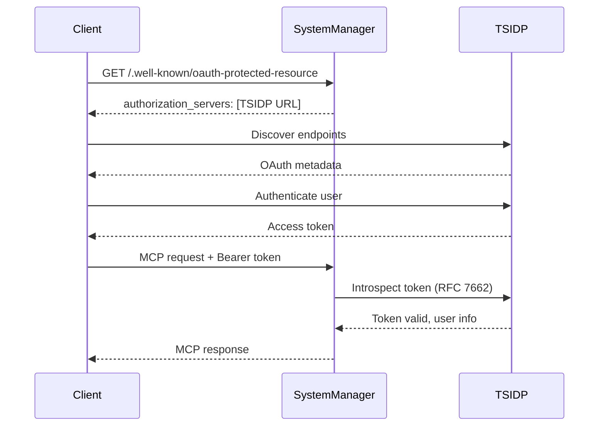

# SystemManager MCP Server - TSIDP Authentication Guide

## Overview

SystemManager now supports OAuth 2.1 authentication using your existing Tailscale Identity Provider (TSIDP). This eliminates the need for custom HMAC tokens and provides enterprise-grade authentication with automatic user identification.

## Prerequisites

- **TSIDP Server**: Running on your Tailnet (e.g., `https://tsidp.tailf9480.ts.net`)
- **Tailscale**: Installed and authenticated on the server
- **FastMCP 1.0+**: Built-in OAuth 2.1 support with Dynamic Client Registration

## Authentication Methods

SystemManager supports two authentication modes via the `SYSTEMMANAGER_AUTH_MODE` environment variable:

### 1. TSIDP OAuth (Recommended)

Uses OAuth 2.1 with automatic Dynamic Client Registration (RFC 7591).

**Advantages:**
- Automatic user authentication via Tailscale
- No manual token management
- Works with standard OAuth clients
- Automatic token refresh
- Introspection support (RFC 7662)

**Setup:**
```bash
export SYSTEMMANAGER_AUTH_MODE=oauth
export SYSTEMMANAGER_AUTH_SERVER=https://tsidp.tailf9480.ts.net
```

### 2. HMAC Token Authentication (Legacy)

Custom token-based authentication for backwards compatibility.

**Setup:**
```bash
export SYSTEMMANAGER_AUTH_MODE=token
export SYSTEMMANAGER_SHARED_SECRET=your-secret-key
```

## Quick Start with TSIDP

### Step 1: Configure TSIDP Application Capability

Grant your MCP server permission to use TSIDP:

```bash
tailscale set -auto-approve --grant="tag:mcp-server" --allow="email,profile"
```

### Step 2: Run SystemManager with OAuth

```bash
cd /opt/systemmanager

# Set environment variables
export SYSTEMMANAGER_AUTH_MODE=oauth
export SYSTEMMANAGER_AUTH_SERVER=https://idp.yourtailnet.ts.net

# Run the server
./venv/bin/python -m src.mcp_server
```

The server will:
1. Discover TSIDP OAuth endpoints automatically
2. Register itself as an OAuth client (Dynamic Client Registration)
3. Store client credentials in `~/.systemmanager/oauth-client.json`
4. Accept authenticated requests with Bearer tokens

### Step 3: Update MCP Client Configuration

Update your `mcp.json` to use OAuth discovery:

```json
{
  "Dev1-SystemManager": {
    "type": "sse",
    "url": "https://systemmanager.yourtailnet.ts.net/sse",
    "description": "SystemManager MCP Server with TSIDP Auth"
  }
}
```

The MCP client will:
1. Discover OAuth endpoints via `/.well-known/oauth-protected-resource`
2. Authenticate with TSIDP automatically
3. Exchange tokens as needed (RFC 8693)

## Configuration Details

### Environment Variables

| Variable | Description | Default | Example |
|----------|-------------|---------|---------|
| `SYSTEMMANAGER_AUTH_MODE` | Authentication mode | `token` | `oauth` |
| `SYSTEMMANAGER_AUTH_SERVER` | TSIDP server URL | - | `https://tsidp.tailf9480.ts.net` |
| `SYSTEMMANAGER_CLIENT_NAME` | OAuth client name | `SystemManager MCP` | `MyCompany SystemManager` |
| `SYSTEMMANAGER_REQUIRED_SCOPES` | Required OAuth scopes | `email,profile` | `email,profile,openid` |

### Discovery Endpoints

SystemManager exposes OAuth discovery endpoints:

- `/.well-known/oauth-protected-resource` - RFC 9728 Protected Resource Metadata
- `/mcp` or `/sse` - MCP transport endpoints

Example discovery response:
```json
{
  "resource": "https://systemmanager.yourtailnet.ts.net",
  "authorization_servers": [
    "https://tsidp.tailf9480.ts.net"
  ],
  "bearer_methods_supported": ["header"],
  "scopes_supported": ["email", "profile"]
}
```

## Using with Different Clients

### Claude Desktop (via mcp-remote)

Since Claude Desktop only supports stdio, use `mcp-remote` as a proxy:

```json
{
  "mcpServers": {
    "systemmanager": {
      "command": "npx",
      "args": [
        "mcp-remote",
        "https://systemmanager.yourtailnet.ts.net/mcp"
      ]
    }
  }
}
```

### Direct HTTP/SSE Client

```python
from fastmcp.client import Client

async with Client("https://systemmanager.yourtailnet.ts.net/sse") as client:
    # Client automatically discovers and authenticates with TSIDP
    result = await client.call_tool("get_system_status")
    print(result)
```

## Token Flow



## Security Features

### Token Introspection

SystemManager validates tokens using OAuth 2.0 Token Introspection (RFC 7662):

- Real-time token validation
- Automatic revocation checking
- Scope verification
- Audience validation

### Scopes

Default required scopes:
- `email` - User email address
- `profile` - User display name and profile

Additional available scopes:
- `system` - System monitoring tools
- `docker` - Container management tools
- `network` - Network status tools

## Troubleshooting

### Server Won't Start

```bash
# Check TSIDP is reachable
curl https://idp.yourtailnet.ts.net/.well-known/openid-configuration

# Check environment variables
env | grep SYSTEMMANAGER

# Check logs
tail -f /opt/systemmanager/logs/mcp_server.log
```

### Authentication Fails

```bash
# Verify TSIDP registration
curl -H "Authorization: Bearer YOUR_TOKEN" \
  https://systemmanager.yourtailnet.ts.net/.well-known/oauth-protected-resource

# Check token introspection
curl -X POST https://idp.yourtailnet.ts.net/introspect \
  -d "token=YOUR_TOKEN" \
  -d "client_id=YOUR_CLIENT_ID" \
  -d "client_secret=YOUR_CLIENT_SECRET"
```

### Dynamic Registration Issues

Force re-registration:

```bash
# Remove cached credentials
rm ~/.systemmanager/oauth-client.json

# Restart with debug logging
SYSTEMMANAGER_LOG_LEVEL=DEBUG ./venv/bin/python -m src.mcp_server
```

## Migration from Token Auth

1. **Update environment variables:**
   ```bash
   # Old
   export SYSTEMMANAGER_AUTH_MODE=token
   export SYSTEMMANAGER_SHARED_SECRET=dev-secret-key
   
   # New
   export SYSTEMMANAGER_AUTH_MODE=oauth
   export SYSTEMMANAGER_AUTH_SERVER=https://idp.yourtailnet.ts.net
   ```

2. **Update client configuration:**
   ```json
   {
     "Dev1-SystemManager": {
       "type": "sse",
       "url": "https://systemmanager.yourtailnet.ts.net/sse"
       // Remove "headers" section - OAuth handles authentication
     }
   }
   ```

3. **Restart the server:**
   ```bash
   sudo systemctl restart systemmanager-mcp
   ```

## Advanced Configuration

### Custom Client Metadata

Create `~/.systemmanager/oauth-client-metadata.json`:

```json
{
  "client_name": "Production SystemManager",
  "client_uri": "https://github.com/mdlmarkham/SystemManager",
  "logo_uri": "https://example.com/logo.png",
  "scope": "openid email profile system docker network"
}
```

### Resource Indicators (RFC 8707)

Request tokens for specific resources:

```bash
export SYSTEMMANAGER_RESOURCE_INDICATORS=https://systemmanager.yourtailnet.ts.net,https://api.example.com
```

### Token Exchange (RFC 8693)

Enable token exchange for proxying:

```bash
export SYSTEMMANAGER_ENABLE_TOKEN_EXCHANGE=true
```

## References

- [TSIDP Documentation](https://github.com/tailscale/tsidp)
- [FastMCP OAuth Guide](https://fastmcp.wiki/en/servers/auth/authentication)
- [RFC 7591 - Dynamic Client Registration](https://www.rfc-editor.org/rfc/rfc7591.html)
- [RFC 7662 - Token Introspection](https://www.rfc-editor.org/rfc/rfc7662.html)
- [RFC 8693 - Token Exchange](https://www.rfc-editor.org/rfc/rfc8693.html)
- [RFC 9728 - Protected Resource Metadata](https://www.rfc-editor.org/rfc/rfc9728.html)
