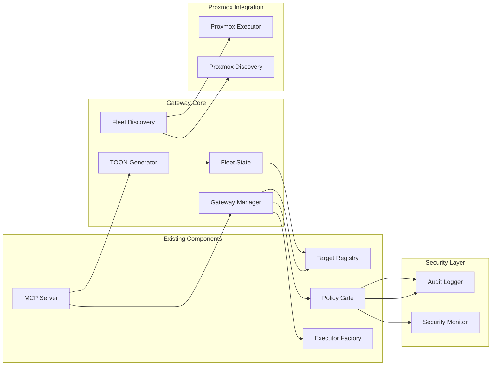

# Gateway Fleet Orchestrator Mode Implementation Plan

## Executive Summary

This plan outlines the implementation of Gateway Fleet Orchestrator mode for the SystemManager TailOpsMCP system. The gateway mode enables one TailOpsMCP instance per Proxmox host to act as a gateway that discovers and manages multiple CTs/VMs within that Proxmox segment, consolidating fleet state and sending concise TOON/JSON summaries to LLMs.

## Architecture Overview

### Gateway vs Local Mode Architecture

### System Architecture Components

## Component Breakdown for 5 Main Deliverables

### 1. Gateway Mode Configuration System
- **Gateway Configuration Model**: Extend [`TargetRegistry`](src/services/target_registry.py) to support gateway-specific settings
- **Mode Detection**: Environment-based mode switching (local vs gateway)
- **Gateway Identity**: Unique gateway identifiers and metadata
- **Configuration Templates**: Gateway-specific YAML configuration templates

### 2. Proxmox Fleet Discovery Engine
- **Proxmox CT/VM Discovery**: Extend [`ProxmoxExecutor`](src/services/proxmox_executor.py) for container discovery
- **Dynamic Target Registration**: Auto-register discovered CTs/VMs in target registry
- **Health Monitoring**: Continuous health checks for fleet members
- **Discovery Scheduling**: Configurable discovery intervals and triggers

### 3. Fleet State Consolidation System
- **State Aggregation**: Collect and consolidate state from all fleet members
- **TOON Generation**: Generate concise TOON summaries for LLM consumption
- **JSON State Export**: Structured JSON state exports
- **Change Detection**: Detect and report state changes across fleet

### 4. Enhanced Security Model
- **Gateway-Specific Policies**: Extend [`PolicyGate`](src/services/policy_gate.py) for gateway operations
- **Fleet-Level Authorization**: Multi-target operation authorization
- **Audit Trail Enhancement**: Structured audit logs for fleet operations
- **Threat Detection**: Gateway-specific threat detection patterns

### 5. Backwards Compatibility Layer
- **Local Mode Preservation**: Ensure existing single-node features work unchanged
- **Configuration Migration**: Tools for migrating from local to gateway mode
- **Feature Parity**: Maintain feature parity between modes
- **Testing Framework**: Comprehensive testing for both modes

## Implementation Phases and Dependencies

### Phase 1: Foundation (Weeks 1-2)
- [ ] Create gateway configuration models and data structures
- [ ] Implement mode detection and switching mechanism
- [ ] Extend target registry for gateway support
- [ ] Create basic gateway identity system

**Dependencies**: Existing [`TargetRegistry`](src/services/target_registry.py), [`TargetMetadata`](src/models/target_registry.py)

### Phase 2: Discovery Engine (Weeks 3-4)
- [ ] Enhance Proxmox executor for CT/VM discovery
- [ ] Implement dynamic target registration
- [ ] Create health monitoring system
- [ ] Build discovery scheduling mechanism

**Dependencies**: [`ProxmoxExecutor`](src/services/proxmox_executor.py), [`TargetDiscovery`](src/services/target_discovery.py)

### Phase 3: State Management (Weeks 5-6)
- [ ] Develop state aggregation system
- [ ] Implement TOON generation for fleet state
- [ ] Create JSON state export functionality
- [ ] Build change detection mechanisms

**Dependencies**: [`Inventory`](src/inventory.py), [`TOON`](src/utils/toon.py) utilities

### Phase 4: Security Enhancement (Weeks 7-8)
- [ ] Extend policy gate for gateway operations
- [ ] Implement fleet-level authorization
- [ ] Enhance audit logging
- [ ] Develop threat detection patterns

**Dependencies**: [`PolicyGate`](src/services/policy_gate.py), [`AuditLogger`](src/utils/audit.py)

### Phase 5: Integration & Testing (Weeks 9-10)
- [ ] Ensure backwards compatibility
- [ ] Create configuration migration tools
- [ ] Implement comprehensive testing
- [ ] Documentation and deployment guides

**Dependencies**: Complete integration with existing MCP server

## Integration Points with Existing Codebase

### Core Integration Points
1. **Target Registry Extension**: Add gateway metadata to [`TargetMetadata`](src/models/target_registry.py)
2. **Executor Factory**: Enhance [`ExecutorFactory`](src/services/executor_factory.py) for gateway executors
3. **Policy Gate Extension**: Add gateway-specific policy rules to [`PolicyGate`](src/services/policy_gate.py)
4. **MCP Server Integration**: Modify [`mcp_server.py`](src/mcp_server.py) for mode-based tool registration

### Data Model Extensions
- **GatewayMetadata**: New model for gateway-specific configuration
- **FleetState**: Consolidated state model for fleet operations
- **DiscoveryConfig**: Configuration for discovery intervals and patterns

### Tool Registration Changes
- Extend [`register_all_tools`](src/tools/__init__.py) for mode-specific tool sets
- Create gateway-specific tools for fleet operations
- Maintain local mode tool compatibility

## Testing Strategy and Backwards Compatibility

### Testing Approach
1. **Unit Testing**: Test individual gateway components in isolation
2. **Integration Testing**: Test gateway-local mode interactions
3. **End-to-End Testing**: Full gateway deployment scenarios
4. **Performance Testing**: Fleet-scale performance validation

### Backwards Compatibility Measures
1. **Environment Variable Fallbacks**: Maintain existing environment variable support
2. **Configuration Migration**: Tools to migrate from local to gateway configuration
3. **Feature Flags**: Controlled rollout of gateway features
4. **Deprecation Warnings**: Clear warnings for deprecated local-only features

### Testing Scenarios
- **Single Gateway Deployment**: One Proxmox host with multiple CTs/VMs
- **Multi-Gateway Deployment**: Multiple Proxmox hosts with cross-gateway communication
- **Mixed Mode Deployment**: Combination of gateway and local instances
- **Migration Testing**: Local to gateway configuration migration

## Security Considerations and Threat Model

### Threat Model for Gateway Mode

**Attack Vectors**:
- Unauthorized gateway access through compromised credentials
- Man-in-the-middle attacks on gateway-to-fleet communication
- Privilege escalation through gateway control
- Denial-of-service attacks on discovery mechanisms

**Security Controls**:
1. **Authentication**: Enhanced gateway authentication with multi-factor support
2. **Authorization**: Granular fleet-level operation authorization
3. **Encryption**: End-to-end encryption for all gateway communications
4. **Audit Logging**: Comprehensive audit trails for all fleet operations

### Security Enhancements
- **Gateway Identity Verification**: Cryptographic verification of gateway identity
- **Fleet Operation Sandboxing**: Isolated execution environments for fleet operations
- **Real-time Threat Detection**: AI-powered anomaly detection for fleet operations
- **Emergency Shutdown**: Rapid shutdown mechanisms for compromised gateways

## Implementation Roadmap

### Phase Deliverables

**Phase 1 Complete**:
- Gateway configuration system operational
- Mode detection working correctly
- Basic gateway identity established

**Phase 2 Complete**:
- Proxmox fleet discovery functional
- Dynamic target registration working
- Health monitoring operational

**Phase 3 Complete**:
- State aggregation system working
- TOON generation for fleet state
- JSON state exports functional

**Phase 4 Complete**:
- Enhanced security model implemented
- Fleet-level authorization working
- Comprehensive audit logging

**Phase 5 Complete**:
- Full backwards compatibility verified
- Comprehensive testing completed
- Production deployment ready

### Success Metrics
- **Discovery Accuracy**: 99%+ accuracy in CT/VM discovery
- **State Consistency**: <1 second state synchronization across fleet
- **Security Compliance**: Zero critical security vulnerabilities
- **Performance**: <5% performance impact on existing operations

## Risk Mitigation

### Technical Risks
- **Performance Impact**: Implement gradual rollout with performance monitoring
- **Security Vulnerabilities**: Comprehensive security testing and peer review
- **Integration Issues**: Extensive integration testing with existing components

### Operational Risks
- **Configuration Complexity**: Provide migration tools and documentation
- **Deployment Challenges**: Create automated deployment scripts
- **Support Requirements**: Develop comprehensive operational guides

## Conclusion

This implementation plan provides a comprehensive roadmap for delivering the Gateway Fleet Orchestrator mode while maintaining the security-first approach and backwards compatibility required. The phased approach ensures systematic development with clear milestones and risk mitigation strategies.

The architecture leverages existing SystemManager components while adding the necessary gateway-specific functionality, ensuring a robust and scalable solution for multi-host Proxmox environment management.